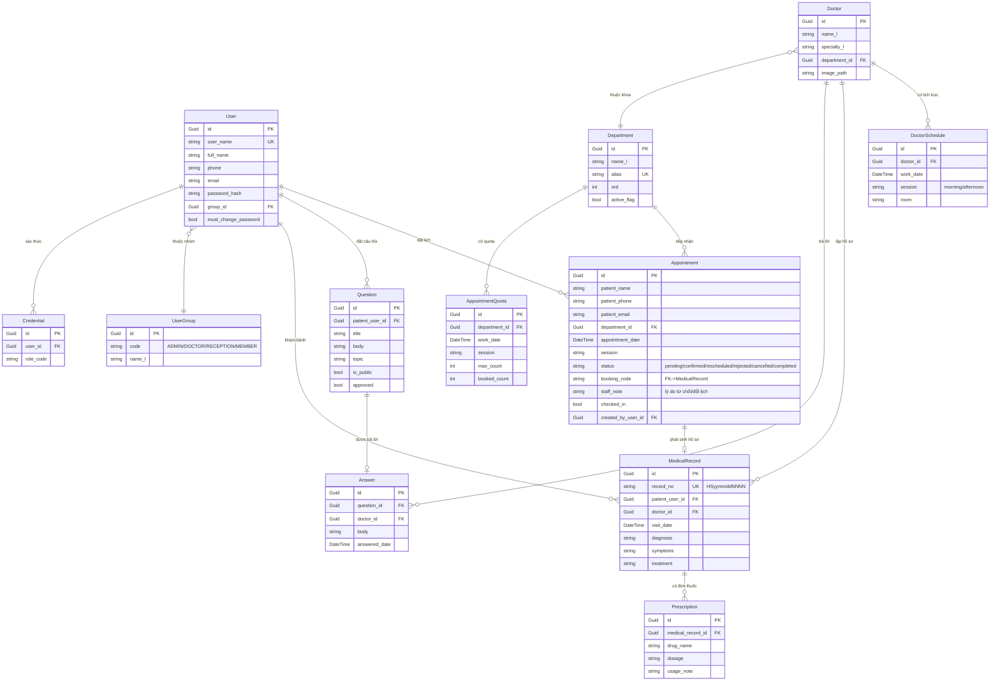
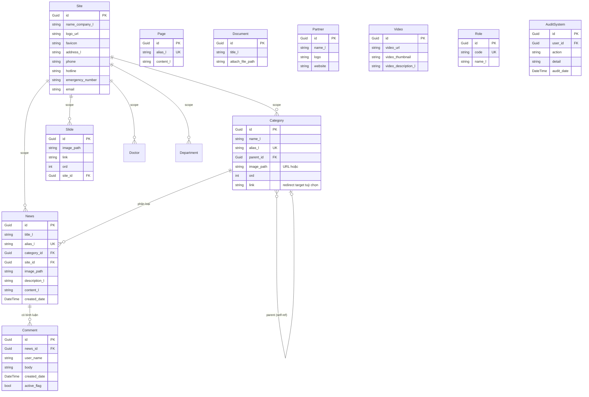

# Cây Dữ Liệu (ERD) — TTYT Kinh Môn

Sơ đồ thực thể–quan hệ của 23 bảng trong CSDL `ttytlp`. Chia 2 cụm: (a) Nghiệp vụ y tế và (b) CMS / quản trị.

## Cụm 1 — Nghiệp vụ y tế (core)

## Cụm 2 — CMS / quản trị

## Quy tắc ràng buộc nghiệp vụ (đã code-enforce)

| Quy tắc | Vị trí enforce | Test |
|---|---|---|
| `Appointment.status` chỉ chuyển theo whitelist | `AppointmentService.AllowedTransitions` | unit + functional |
| Reject phải có lý do (`staff_note`) | `AppointmentService.UpdateStatusAsync` | unit + functional |
| Bệnh nhân không đặt 2 lịch trùng buổi | `AppointmentService.CreateAsync` (duplicate check) | unit + functional |
| Quota không vượt `max_count` khi confirm | `AppointmentService.UpdateStatusAsync` | unit |
| `MedicalRecord.record_no` unique (race-safe retry 5 lần) | `MedicalRecordService.CreateAsync` | unit |
| Bác sĩ A không truy cập bệnh nhân của bác sĩ B | `DoctorPortalController.ChanDoan` cross-guard | functional |
| Check-in chỉ khi `confirmed` + đúng ngày | `LeTanController.MarkCheckedIn` | unit |
| Q&A submit yêu cầu login | `QnaController.DatCauHoi` | functional |
| Length cap 500/200/100 ký tự cho note/drug/dosage | service layer | unit |
