# Sơ Đồ Use Case — TTYT Kinh Môn

4 actor: **Bệnh nhân** (Member/Khách), **Lễ tân** (Reception), **Bác sĩ** (Doctor), **Quản trị** (Admin).

## Use case tổng quan

```mermaid
graph TB
    subgraph "Public / Khách"
        UC01[Xem trang chủ]
        UC02[Xem chuyên khoa / bác sĩ]
        UC03[Tra cứu tin tức / văn bản]
        UC04[Đăng ký tài khoản]
        UC05[Đăng nhập]
        UC06[Đặt lịch khám với tư cách khách]
    end

    subgraph "Bệnh nhân (Member đã đăng nhập)"
        UC07[Đặt lịch khám]
        UC08[Xem Lịch của tôi]
        UC09[Theo dõi trạng thái real-time]
        UC10[Xem lý do từ chối/đổi lịch]
        UC11[Đặt câu hỏi cho bác sĩ]
        UC12[Xem Câu hỏi của tôi]
        UC13[Xem lịch sử khám]
        UC14[Đổi mật khẩu]
        UC15[Cập nhật hồ sơ cá nhân]
    end

    subgraph "Lễ tân (Reception)"
        UC20[Xem danh sách lịch hẹn]
        UC21[Xác nhận lịch → sinh mã khám]
        UC22[Từ chối lịch + lý do bắt buộc]
        UC23[Đề nghị đổi lịch]
        UC24[Check-in bệnh nhân ngày khám]
        UC25[Quản lý quota suất khám]
        UC26[Xem lịch trực bác sĩ]
        UC27[Polling stat real-time]
    end

    subgraph "Bác sĩ (Doctor)"
        UC30[Xem bệnh nhân hôm nay]
        UC31[Tạo hồ sơ khám + chẩn đoán]
        UC32[Kê đơn thuốc]
        UC33[Đánh dấu lịch hoàn tất]
        UC34[Duyệt + trả lời câu hỏi]
    end

    subgraph "Admin"
        UC40[Cấu hình site logo/favicon]
        UC41[Quản lý News/Category/Department]
        UC42[Quản lý Doctor/User/Role]
        UC43[Quản lý Slide/Video/Document]
        UC44[Xem audit log]
        UC45[Force change password cho user]
    end

    Patient((Bệnh nhân))
    Reception((Lễ tân))
    Doctor((Bác sĩ))
    Admin((Admin))

    Patient --> UC04 & UC05 & UC06 & UC07 & UC08 & UC09 & UC10 & UC11 & UC12 & UC13 & UC14 & UC15
    Reception --> UC20 & UC21 & UC22 & UC23 & UC24 & UC25 & UC26 & UC27
    Doctor --> UC30 & UC31 & UC32 & UC33 & UC34
    Admin --> UC40 & UC41 & UC42 & UC43 & UC44 & UC45
```

## Use case chi tiết — UC07 "Đặt lịch khám"

| Mục | Nội dung |
|---|---|
| **Mã UC** | UC07 |
| **Actor** | Bệnh nhân (đã login hoặc khách vãng lai) |
| **Mô tả** | Bệnh nhân đặt lịch khám trực tuyến cho bản thân |
| **Tiền điều kiện** | Có thông tin liên lạc (SĐT bắt buộc); chuyên khoa active; ngày khám trong khoảng `[hôm nay, hôm nay + N ngày]` (N = `MaxDaysAhead` = 30) |
| **Hậu điều kiện** | Tạo `Appointment` với `status='pending'`; `AppointmentQuota.booked_count` chưa tăng (chỉ tăng khi confirm) |
| **Luồng chính** | 1. Truy cập `/dat-lich-kham` 2. Nhập họ tên, SĐT, email (tuỳ chọn), chuyên khoa, ngày, buổi (sáng/chiều), lý do 3. Submit form 4. Hệ thống validate (ngày hợp lệ, chuyên khoa active, không trùng buổi với lịch pending khác) 5. Lưu DB, trả flash success "Đã đặt lịch — chờ lễ tân xác nhận" |
| **Luồng phụ — login** | Banner gợi ý đăng nhập/đăng ký xuất hiện khi `CurrentUser==null` |
| **Luồng ngoại lệ** | Trùng buổi → `409 "Bạn đã có lịch buổi này, vui lòng chọn buổi khác"` Ngày quá khứ → `400 "Ngày khám không hợp lệ"` Vượt MaxDaysAhead → `400 "Chỉ đặt được trong vòng 30 ngày"` Khoa inactive → `400 "Chuyên khoa không khả dụng"` |
| **Test cases liên quan** | TC-007, TC-008, TC-009, TC-010, TC-011 |

## Use case chi tiết — UC21 "Lễ tân xác nhận lịch"

| Mục | Nội dung |
|---|---|
| **Mã UC** | UC21 |
| **Actor** | Lễ tân (Reception) |
| **Mô tả** | Lễ tân duyệt lịch `pending` thành `confirmed`, sinh mã khám |
| **Tiền điều kiện** | Đăng nhập với `group_id=RECEPTION`; `Appointment.status='pending'`; quota chưa đầy |
| **Hậu điều kiện** | `Appointment.status='confirmed'`, `booking_code` được sinh, `AppointmentQuota.booked_count += 1`, audit log, bệnh nhân thấy update qua polling JS |
| **Luồng chính** | 1. `/le-tan/lich-hen?status=pending` → click 1 lịch 2. Form chuyển trạng thái → chọn `confirmed` 3. Submit (CSRF token) 4. Service check whitelist transition pending→confirmed (whitelist OK) 5. Service check quota max_count 6. Generate booking_code, update DB, audit |
| **Luồng ngoại lệ** | Quota đầy → `"Buổi này đã hết suất"` Status không phải pending → blocked by whitelist CSRF token mismatch → 400 User không phải lễ tân → 403 |

## Use case chi tiết — UC31 "Bác sĩ tạo hồ sơ khám"

| Mục | Nội dung |
|---|---|
| **Mã UC** | UC31 |
| **Actor** | Bác sĩ (Doctor) |
| **Mô tả** | Bác sĩ tạo `MedicalRecord` cho bệnh nhân đã check-in |
| **Tiền điều kiện** | Đăng nhập group=DOCTOR; bệnh nhân có `Appointment` `confirmed` + `checked_in=true` + đúng bác sĩ |
| **Hậu điều kiện** | `MedicalRecord` mới với `record_no=HSyymmddNNNN`; `Prescription[]` (nếu có) ; `Appointment.status='completed'`; audit |
| **Luồng chính** | 1. `/bac-si-portal/benh-nhan-hom-nay` → chọn bệnh nhân 2. `/bac-si-portal/chan-doan/{apptId}` form 3. Nhập triệu chứng / chẩn đoán / điều trị / đơn thuốc (drug_name+dosage, max 50 dòng) 4. Submit → service generate record_no (race-safe retry 5x) |
| **Luồng ngoại lệ** | Bệnh nhân không thuộc bác sĩ này → 403 cross-doctor guard Chưa check-in → 400 Diagnosis trống → 400 record_no collision → retry; sau 5 lần fail → 500 |
