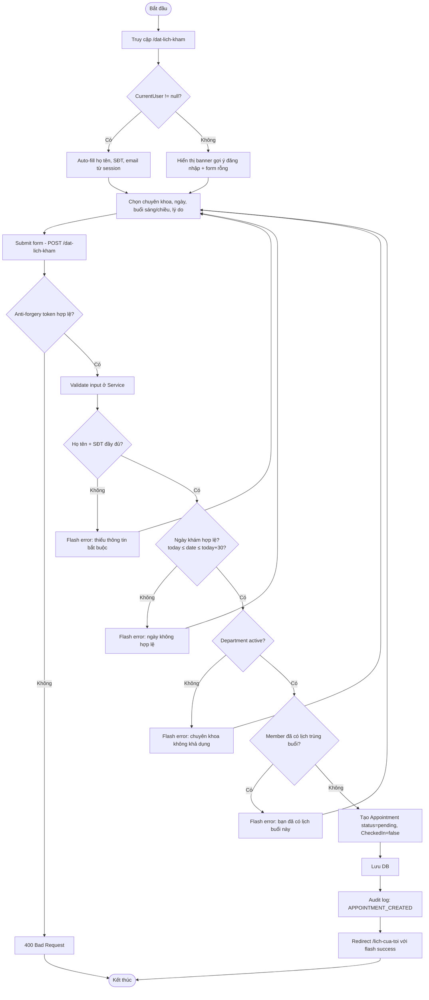
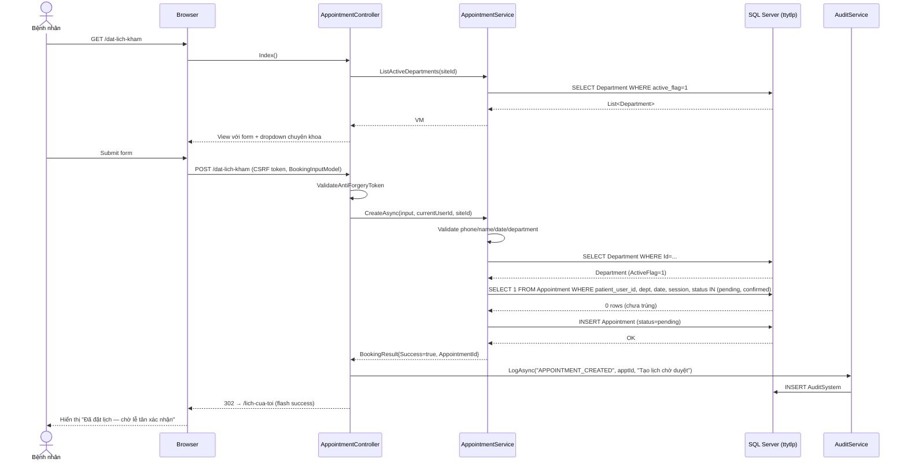
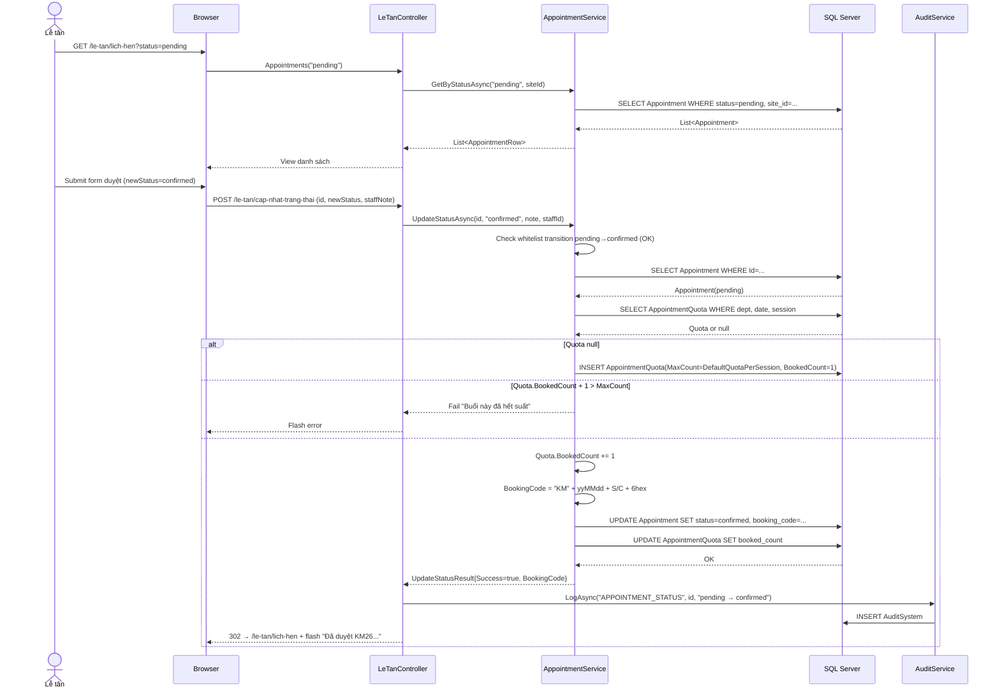
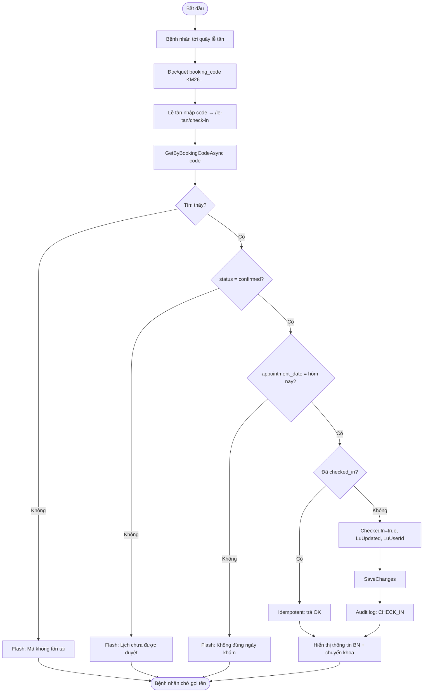
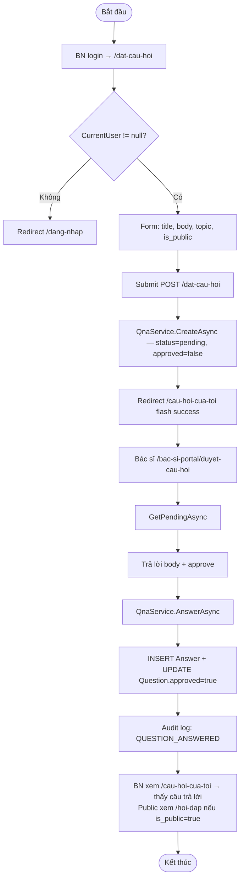
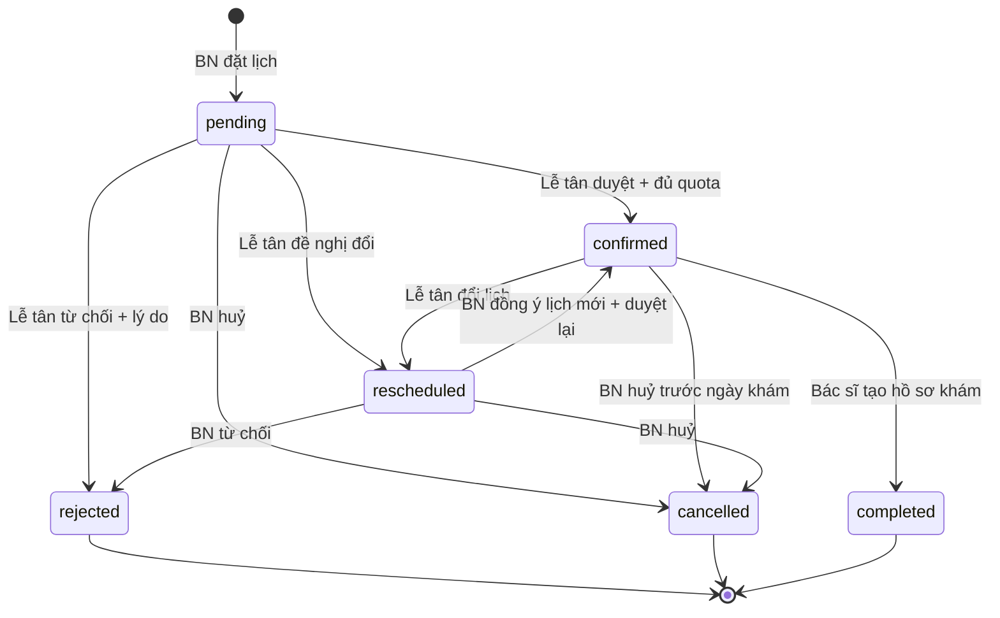

# Sơ Đồ Hoạt Động (Activity & Sequence Diagram) — TTYT Kinh Môn

Tài liệu mô tả luồng nghiệp vụ chi tiết cho 5 flow chính của hệ thống. Mọi sơ đồ render bằng Mermaid (xem trên GitHub / VS Code preview).

Quy ước:
- Activity diagram: thể hiện rẽ nhánh, quyết định, trạng thái nghiệp vụ.
- Sequence diagram: thể hiện thông điệp giữa Browser → Controller → Service → DB và side-effect (booking code, audit log, quota delta).

---

## 1. UC07 — Đặt lịch khám trực tuyến

### 1.1 Activity diagram

### 1.2 Sequence diagram

---

## 2. UC21 — Lễ tân duyệt lịch + sinh booking code

### 2.1 Activity diagram

```mermaid
flowchart TD
    Start([Bắt đầu]) --> A1[Lễ tân login → /le-tan]
    A1 --> Q1{Group=RECEPTION?}
    Q1 -- Không --> E0[403 Forbidden cross-portal guard]
    Q1 -- Có --> A2[Truy cập /le-tan/lich-hen?status=pending]
    A2 --> A3[Service.GetByStatusAsync filter siteId]
    A3 --> A4[Click 1 lịch → /le-tan/chi-tiet/&#123;id&#125;]
    A4 --> A5[Chọn newStatus: confirmed/rejected/rescheduled]
    A5 --> A6[Submit form UpdateStatus]
    A6 --> Q2{Anti-forgery + StaffAuthorize OK?}
    Q2 -- Không --> E1[401/403]
    Q2 -- Có --> A7[Service.UpdateStatusAsync]
    A7 --> Q3{newStatus thuộc whitelist?}
    Q3 -- Không --> E2[Lỗi: trạng thái không hợp lệ]
    Q3 -- Có --> Q4{Transition oldStatus → newStatus<br/>nằm trong AllowedTransitions?}
    Q4 -- Không --> E3[Lỗi: không thể chuyển trạng thái]
    Q4 -- Có --> Q5{newStatus = rejected?}
    Q5 -- Có --> Q6{StaffNote không trống?}
    Q6 -- Không --> E4[Lỗi: vui lòng nhập lý do từ chối]
    Q6 -- Có --> A8[Đặt status=rejected]
    Q5 -- Không --> Q7{newStatus = confirmed?}
    Q7 -- Có --> A9[Đọc/Tạo AppointmentQuota row]
    A9 --> Q8{BookedCount + 1 ≤ MaxCount?}
    Q8 -- Không --> E5[Lỗi: buổi này đã hết suất]
    Q8 -- Có --> A10[BookedCount += 1]
    A10 --> A11[Sinh booking_code KM yyMMdd S/C 6hex]
    A11 --> A12[Đặt status=confirmed]
    Q7 -- Không --> A13[confirmed → cancelled/rescheduled<br/>BookedCount -= 1]
    A8 --> A14[SaveChanges]
    A12 --> A14
    A13 --> A14
    A14 --> Q9{DbUpdateConcurrencyException?}
    Q9 -- Có & retry < 3 --> A7
    Q9 -- Có & retry = 3 --> E6[Lỗi: có người khác đã update — thử lại]
    Q9 -- Không --> A15[Audit log: APPOINTMENT_STATUS oldStatus → newStatus]
    A15 --> A16[Redirect về danh sách + flash success]
    A16 --> End([Kết thúc])
    E0 --> End
    E1 --> End
    E2 --> A5
    E3 --> A5
    E4 --> A5
    E5 --> A5
    E6 --> End
```

### 2.2 Sequence diagram

---

## 3. UC24 — Check-in bệnh nhân ngày khám

---

## 4. UC31 — Bác sĩ tạo hồ sơ khám

### 4.1 Activity diagram

```mermaid
flowchart TD
    Start([Bắt đầu]) --> A1[Bác sĩ login → /bac-si-portal]
    A1 --> A2[Vào /bac-si-portal/benh-nhan-hom-nay]
    A2 --> A3[GetTodayConfirmedAsync filter checked_in=true, doctor_id=current]
    A3 --> A4[Chọn 1 BN → /bac-si-portal/chan-doan/&#123;apptId&#125;]
    A4 --> Q1{Cross-doctor guard:<br/>appt.doctor_id = current doctor?}
    Q1 -- Không --> E0[403: bệnh nhân không thuộc bác sĩ này]
    Q1 -- Có --> A5[Form: triệu chứng, chẩn đoán, điều trị, đơn thuốc]
    A5 --> A6[Submit POST /bac-si-portal/luu-ho-so]
    A6 --> Q2{Diagnosis không trống?}
    Q2 -- Không --> E1[Flash: chẩn đoán bắt buộc]
    Q2 -- Có --> A7[NextRecordNoAsync sinh HSyymmddNNNN]
    A7 --> A8[Tạo MedicalRecord]
    A8 --> A9[Insert Prescription nếu có]
    A9 --> A10[SaveChanges]
    A10 --> Q3{DbUpdateException - record_no collision?}
    Q3 -- Có & retry < 5 --> A7
    Q3 -- Có & retry = 5 --> E2[500: lỗi sinh mã hồ sơ]
    Q3 -- Không --> A11[UpdateStatus appt → completed]
    A11 --> A12[Audit log: MEDICAL_RECORD_CREATED]
    A12 --> A13[Redirect /bac-si-portal/benh-nhan-hom-nay + flash]
    A13 --> End([Kết thúc])
    E0 --> End
    E1 --> A5
    E2 --> End
```

### 4.2 Sequence diagram

```mermaid
sequenceDiagram
    actor D as Bác sĩ
    participant Br as Browser
    participant Ctrl as DoctorPortalController
    participant ApptSvc as AppointmentService
    participant MrSvc as MedicalRecordService
    participant DB as SQL Server
    participant Au as AuditService

    D->>Br: GET /bac-si-portal/chan-doan/&#123;apptId&#125;
    Br->>Ctrl: ChanDoan(apptId)
    Ctrl->>ApptSvc: GetByIdAsync(apptId)
    ApptSvc-->>Ctrl: Appointment
    Ctrl->>Ctrl: assert appt.doctor_id == currentDoctorId
    Ctrl-->>Br: View form chẩn đoán

    D->>Br: Submit (diagnosis, prescriptions[])
    Br->>Ctrl: POST /bac-si-portal/luu-ho-so
    Ctrl->>MrSvc: CreateAsync(MedicalRecordInput, doctorId, patientId)
    loop Retry up to 5x on collision
        MrSvc->>MrSvc: NextRecordNoAsync — count today, format HSyymmddNNNN
        MrSvc->>DB: INSERT MedicalRecord, Prescription[]
        DB-->>MrSvc: OK or DbUpdateException
    end
    MrSvc-->>Ctrl: MedicalRecord
    Ctrl->>ApptSvc: UpdateStatusAsync(apptId, "completed", null, doctorId)
    ApptSvc->>DB: UPDATE Appointment SET status=completed
    Ctrl->>Au: LogAsync("MEDICAL_RECORD_CREATED", recordId, record_no)
    Au->>DB: INSERT AuditSystem
    Ctrl-->>Br: 302 → /bac-si-portal/benh-nhan-hom-nay
```

---

## 5. UC11 + UC34 — Q&A: Đặt câu hỏi → Bác sĩ trả lời

---

## 6. State diagram — Vòng đời Appointment

**Whitelist** đã code-enforce trong `AppointmentService.AllowedTransitions`:

| Old status | Allowed new status |
|---|---|
| `pending` | `confirmed`, `rejected`, `cancelled`, `rescheduled` |
| `confirmed` | `completed`, `cancelled`, `rescheduled` |
| `rescheduled` | `confirmed`, `rejected`, `cancelled` |
| `rejected` / `cancelled` / `completed` | (terminal — không cho đổi) |

Mọi transition vi phạm → reject với message `"Không thể chuyển trạng thái '{old}' → '{new}'"`.

---

## 7. Tham chiếu chéo

| Sơ đồ | Use case | Controller | Service | Test cases |
|---|---|---|---|---|
| §1 Đặt lịch | UC07 | `AppointmentController.Index` | `AppointmentService.CreateAsync` | TC-007 → TC-011 |
| §2 Duyệt lịch | UC21 | `LeTanController.UpdateStatus` | `AppointmentService.UpdateStatusAsync` | TC-020 → TC-024 |
| §3 Check-in | UC24 | `LeTanController.MarkCheckedIn` | `AppointmentService.MarkCheckedInAsync` | TC-025, TC-026 |
| §4 Hồ sơ khám | UC31 | `DoctorPortalController.ChanDoan` | `MedicalRecordService.CreateAsync` | TC-030 → TC-033 |
| §5 Q&A | UC11+UC34 | `QnaController` + `DoctorPortalController.AnswerQuestion` | `QnaService` | TC-040 → TC-043 |
| §6 State | UC07+UC21+UC31 | All | `AppointmentService.AllowedTransitions` | TC-050, TC-051 |
