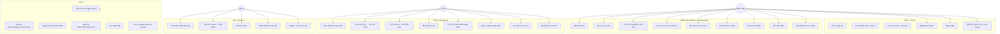
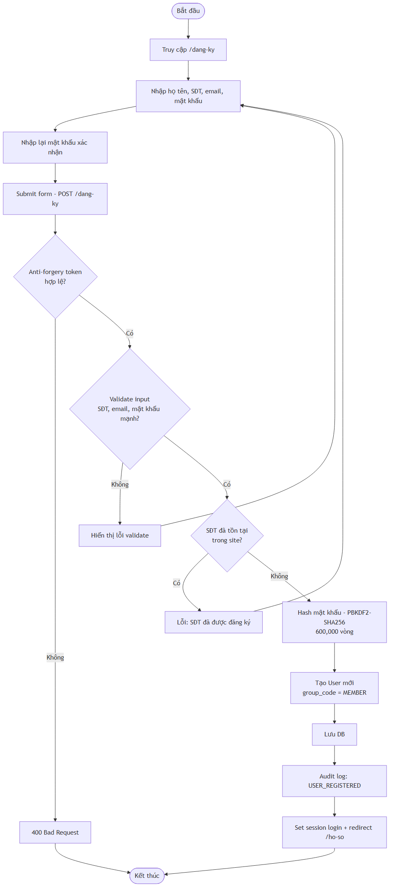
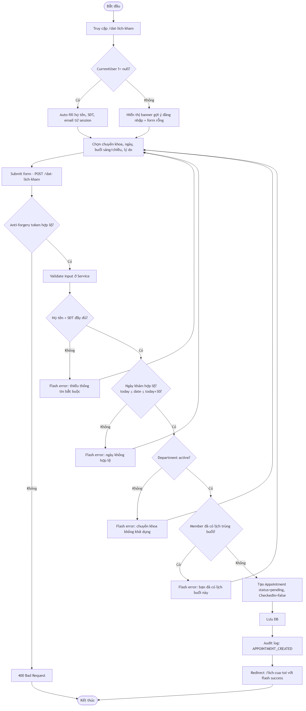
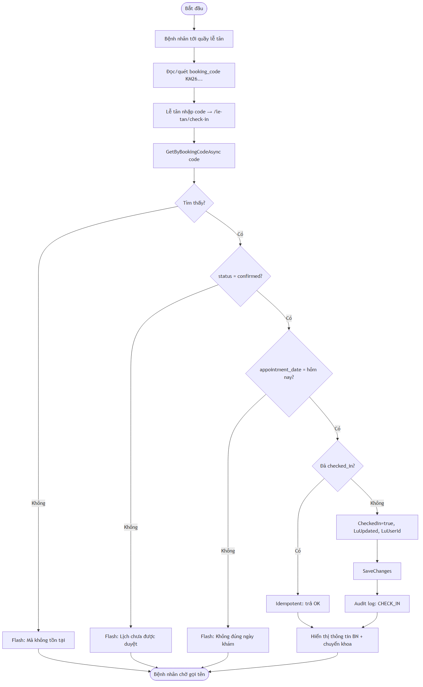
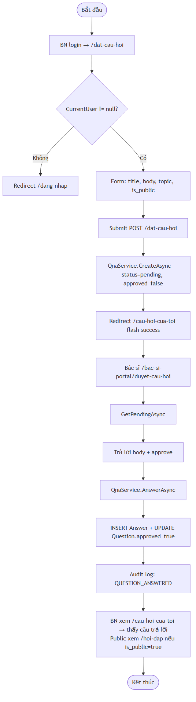
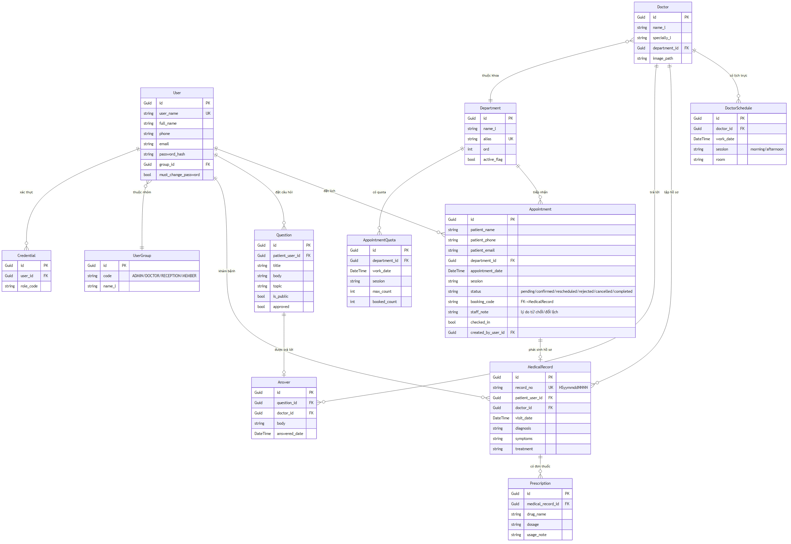

# CHƯƠNG 2. KHẢO SÁT VÀ THIẾT KẾ WEBSITE Y TẾ TTYT PHƯỜNG KINH MÔN

## 2.1. Khảo sát hiện trạng

### 2.1.1. Khảo sát thực tế tại Trung tâm Y tế phường Kinh Môn

Trước khi thiết kế hệ thống, đồ án tiến hành khảo sát trực tiếp tại Trung tâm Y tế phường Kinh Môn (Số 294 đường Trần Hưng Đạo, phường Kinh Môn, TP Hải Phòng) thông qua phỏng vấn cán bộ lễ tân, bác sĩ và quan sát quy trình tiếp đón bệnh nhân. Kết quả khảo sát được tổng hợp trong bảng sau:

**Bảng 2.1. Hiện trạng quy trình ngoại trú tại TTYT phường Kinh Môn**

| **STT** | **Khía cạnh** | **Hiện trạng (trước cải tiến)** |
|:--:|:--|:--|
| 1 | Hình thức tiếp nhận | 100% bệnh nhân đến trực tiếp, không có đặt lịch trước |
| 2 | Lượt khám trung bình | Dưới 100 lượt / ngày, phân bố không đều |
| 3 | Thời gian chờ trung bình | 30 – 60 phút trong giờ cao điểm (8h–10h sáng) |
| 4 | Cơ chế đăng ký | Sổ giấy tại quầy lễ tân, gọi tên theo thứ tự đến trước |
| 5 | Hồ sơ khám | Bệnh án giấy, lưu trong tủ hồ sơ theo mã bệnh nhân |
| 6 | Kê đơn thuốc | Đơn thuốc viết tay, photo lưu lại 1 bản cho cơ sở |
| 7 | Kênh hỏi đáp | Gọi điện hotline 0220.3.822.205 trong giờ hành chính |
| 8 | Phân lịch trực bác sĩ | Trưởng khoa lập tay theo từng tháng, dán bảng tin |
| 9 | Báo cáo lưu lượng | Thống kê thủ công cuối tháng dựa trên sổ sách |

Từ bảng khảo sát có thể thấy ngay những điểm hạn chế: bệnh nhân không chủ động được thời gian, không có dữ liệu số để dự báo, hồ sơ khám lưu giấy khó tra cứu, kênh hỏi đáp giới hạn theo giờ hành chính. Đây chính là cơ sở để xác định các nhóm chức năng cần phát triển trong website.

### 2.1.2. Quan sát các website đặt lịch khám trực tuyến tham khảo

Để tham khảo mô hình tổ chức giao diện và nghiệp vụ, đồ án khảo sát ba cơ sở y tế đại diện cho ba phân khúc khác nhau **trong cùng địa bàn Hải Phòng — Hải Dương** (phường Kinh Môn từ năm 2025 thuộc TP Hải Phòng sau sáp nhập với tỉnh Hải Dương cũ):

- **Bệnh viện Đa khoa Quốc tế Hải Phòng — HIH** (`hih.vn`) — bệnh viện tư nhân quốc tế lớn nhất TP Hải Phòng (124 Nguyễn Đức Cảnh, Lê Chân), đại diện cho mô hình tư nhân hiện đại với hệ thống đặt lịch online riêng tại `register.hih.vn` và tra cứu kết quả xét nghiệm trực tuyến;

- **Bệnh viện Đa khoa Hải Dương** (`benhviendakhoahaiduong.vn`) — bệnh viện công lập **hạng I tuyến tỉnh** trên địa bàn Hải Dương cũ, có hệ thống "Đăng ký khám bệnh trực tuyến" tại `dkkham.benhviendakhoahaiduong.vn`, là cơ sở y tế tuyến trên thường tiếp nhận chuyển tuyến từ TTYT phường Kinh Môn;

- **Bệnh viện Hữu nghị Việt Tiệp Hải Phòng** (`viettiephospital.vn`) — bệnh viện đa khoa **hạng I tuyến TP**, là cơ sở y tế công lập lớn nhất TP Hải Phòng và vùng Duyên hải Bắc Bộ, có hệ thống đặt lịch khám online (`appointment-booking`, `personal-booking`) dành cho cả khám BHYT và khám theo yêu cầu, hotline 1900 23 23 61.

Kết quả quan sát được tổng hợp trong bảng sau:

**Bảng 2.2. So sánh các website đặt lịch khám tham khảo cùng địa bàn HP — HD**

| **Tiêu chí** | **HIH (Đa khoa Quốc tế HP)** | **BVĐK Hải Dương** | **BV Việt Tiệp HP** |
|:--|:--|:--|:--|
| Mô hình | Tư nhân quốc tế | Công lập tuyến tỉnh hạng I | Công lập tuyến TP hạng I |
| Đặt lịch online | Có (sub-domain `register.hih.vn`) | Có (sub-domain `dkkham…`) | Có (`appointment-booking`) |
| Đặt theo bác sĩ | Có | Theo chuyên khoa | Theo chuyên khoa |
| Đặt theo dịch vụ | Có (đầy đủ gói khám) | Có (gói khám) | Có (khám BHYT + theo yêu cầu) |
| Mã booking | Có (kèm SMS xác nhận) | Có | Có |
| Yêu cầu đăng ký | Khuyến khích | Không bắt buộc | Không bắt buộc |
| Hồ sơ điện tử | Tra cứu kết quả XN online | Đang triển khai | Đang triển khai |
| Q&A bác sĩ | Form contact + hotline | Hotline | Hotline 1900 23 23 61 |
| Mobile responsive | Có (chưa có App) | Có (chưa có App) | Có (chưa có App) |
| Đặc điểm tham chiếu | BV tư nhân quốc tế lớn nhất HP, hệ đặt lịch riêng | Đơn giản, dành cho người dân địa phương HD cũ | Quy mô tuyến TP, đầy đủ BHYT + tự nguyện |

**Nhận xét chung:**

- Cả ba cơ sở đều áp dụng cơ chế **đặt lịch trước → xác nhận → mã booking** tương đồng với mô hình mà đồ án đề xuất cho TTYT phường Kinh Môn — đây là chuẩn chung của các hệ thống đặt lịch khám hiện nay;
- HIH (Đa khoa Quốc tế Hải Phòng) có giao diện chuyên nghiệp, hệ thống đặt lịch riêng trên sub-domain `register.hih.vn`, tuy nhiên form đặt lịch yêu cầu nhập khá nhiều trường — qua đó rút ra bài học **đơn giản hóa luồng đặt lịch xuống còn 4 bước**;
- BVĐK Hải Dương có giao diện đơn giản, ngôn ngữ thuần Việt, phù hợp với đối tượng người dân địa phương — cách trình bày bảng giá dịch vụ và bảng lịch trực bác sĩ theo tuần được tham khảo trong đồ án;
- BV Việt Tiệp Hải Phòng là cơ sở tuyến TP, quản lý cả khám BHYT và khám theo yêu cầu — cung cấp tham chiếu về cách phân nhóm dịch vụ và sắp xếp danh mục chuyên khoa;
- **Khác biệt của TTYT phường Kinh Môn:** Trung tâm Y tế phường Kinh Môn tiền thân là **Bệnh viện Đa khoa Kinh Môn — cơ sở y tế công lập hạng II đạt chuẩn quốc gia**, từng trực thuộc Sở Y tế Hải Dương, có đầy đủ đội ngũ bác sĩ và các khoa phòng chức năng tương đương ba cơ sở tham chiếu. Sau khi sáp nhập đơn vị hành chính, đơn vị được tổ chức lại thành TTYT phường, **tập trung vào khám chữa bệnh ngoại trú và y tế cộng đồng**. Vì vậy website trong đồ án vẫn đáp ứng đầy đủ các nghiệp vụ chuẩn của bệnh viện hạng II (đặt lịch theo bác sĩ + theo dịch vụ, hồ sơ bệnh án điện tử, quản lý lịch trực, audit log, hỗ trợ BHYT…) — chỉ tinh gọn ở phạm vi ngoại trú, lược bỏ các module nội trú dài ngày, phẫu thuật, hậu phẫu vốn chỉ cần ở tuyến tỉnh/TP;
- Q&A có bác sĩ trả lời là tính năng tạo điểm khác biệt cho TTYT cấp phường — tận dụng đội ngũ bác sĩ đa nhiệm của Trung tâm để tăng kết nối với người dân;
- Hỗ trợ thiết bị di động là yêu cầu bắt buộc — quan sát thực tế cho thấy đa số người dân địa bàn Hải Phòng — Hải Dương truy cập website y tế qua điện thoại Android tầm trung, do đó website trong đồ án được thiết kế responsive đồng thời cho iPhone X (375 px) và iPhone SE (320 px) ngay từ đầu.

Trên cơ sở khảo sát thực tế và quan sát các nền tảng tham khảo, đồ án xác định bảy nhóm nghiệp vụ chính cần triển khai: (1) Đặt lịch khám, (2) Duyệt và xác nhận lịch, (3) Check-in tại cơ sở, (4) Chẩn đoán và kê đơn, (5) Quản lý hồ sơ y tế, (6) Hỏi đáp, (7) Quản trị hệ thống.

## 2.2. Thiết kế biểu đồ Use Case

### 2.2.1. Biểu đồ use case tổng quát

Hệ thống có **bốn vai trò người dùng (actor)**: Bệnh nhân (Member), Lễ tân (Reception), Bác sĩ (Doctor), Quản trị viên (Admin). Mỗi vai trò có một tập quyền riêng, được kiểm soát thông qua bảng `system_user_group`.

{width=15cm}

Sơ đồ tổng quát mô tả bốn actor cùng các nhóm nghiệp vụ chính: Đặt lịch, Duyệt lịch, Khám, Q&A, Quản trị. Các chi tiết từng use case được mô tả trong các mục từ 2.2.2 đến 2.2.7.

### 2.2.2. Use case Đặt lịch khám

**Bảng 2.3. Mô tả use case Đặt lịch khám**

| **Trường** | **Nội dung** |
|:--|:--|
| **Mã use case** | UC-01 |
| **Tên use case** | Đặt lịch khám |
| **Tác nhân** | Bệnh nhân (Member hoặc Khách vãng lai) |
| **Mô tả** | Cho phép bệnh nhân đặt lịch khám theo bác sĩ, chuyên khoa, ngày và ca khám |
| **Điều kiện trước** | Có ít nhất một bác sĩ đang hoạt động và có lịch trực còn slot trống |
| **Luồng sự kiện chính** | 1. Bệnh nhân chọn menu *"Đặt lịch khám"* 2. Hệ thống hiển thị form: chọn chuyên khoa → chọn bác sĩ → chọn ngày → chọn ca 3. Hệ thống lọc các slot còn trống dựa trên lịch trực và quota 4. Bệnh nhân nhập họ tên, SĐT, email, lý do khám 5. Hệ thống xác thực CSRF token, kiểm tra dữ liệu hợp lệ 6. Hệ thống lưu lịch ở trạng thái *Pending*, gửi thông báo cho lễ tân 7. Hệ thống chuyển bệnh nhân tới trang xác nhận, hiển thị mã đặt lịch tạm |
| **Luồng phụ** | – Slot đã đầy: hiển thị thông báo, gợi ý ngày khác – Trùng lịch (cùng SĐT, cùng ngày): hiển thị cảnh báo |
| **Điều kiện sau** | Lịch hẹn ở trạng thái *Pending*, chờ lễ tân duyệt |

### 2.2.3. Use case Duyệt và xác nhận lịch hẹn

**Bảng 2.4. Mô tả use case Duyệt lịch hẹn**

| **Trường** | **Nội dung** |
|:--|:--|
| **Mã use case** | UC-02 |
| **Tên use case** | Duyệt và xác nhận lịch hẹn |
| **Tác nhân** | Lễ tân (Reception) |
| **Điều kiện trước** | Đã đăng nhập, có lịch ở trạng thái *Pending* |
| **Luồng sự kiện chính** | 1. Lễ tân vào *"Cổng Lễ tân → Lịch hẹn → Chờ duyệt"* 2. Hệ thống liệt kê các lịch sắp xếp theo thời gian gửi 3. Lễ tân nhấn *"Xác nhận"* trên một lịch 4. Hệ thống áp dụng state machine: Pending → Confirmed (chỉ cho phép các transition trong whitelist) 5. Sinh mã booking dạng `KMyymmddS|C` (S = sáng, C = chiều) tăng dần trong ngày 6. Ghi audit log: action = APPOINTMENT_CONFIRMED, before = Pending, after = Confirmed 7. Cập nhật quota slot khám của bác sĩ |
| **Luồng phụ** | – Từ chối: yêu cầu nhập lý do (`staff_note` >= 5 ký tự) – Trùng lịch quota: hệ thống chặn không cho confirm |
| **Điều kiện sau** | Lịch hẹn có mã booking, sẵn sàng cho check-in |

### 2.2.4. Use case Check-in bệnh nhân

**Bảng 2.5. Mô tả use case Check-in bệnh nhân**

| **Trường** | **Nội dung** |
|:--|:--|
| **Mã use case** | UC-03 |
| **Tác nhân** | Lễ tân |
| **Mô tả** | Đánh dấu bệnh nhân đã đến tại cơ sở, đẩy lịch sang trạng thái sẵn sàng khám |
| **Luồng chính** | 1. Lễ tân nhập SĐT bệnh nhân hoặc quét mã booking 2. Hệ thống hiển thị lịch hẹn của ngày 3. Lễ tân nhấn *"Check-in"* 4. Hệ thống chuyển trạng thái Confirmed → CheckedIn 5. Bác sĩ thấy bệnh nhân trong danh sách *"Bệnh nhân hôm nay"* |
| **Điều kiện sau** | Lịch hẹn ở trạng thái CheckedIn, hiển thị bên Cổng Bác sĩ |

### 2.2.5. Use case Chẩn đoán và kê đơn

**Bảng 2.6. Mô tả use case Chẩn đoán và kê đơn thuốc**

| **Trường** | **Nội dung** |
|:--|:--|
| **Mã use case** | UC-04 |
| **Tác nhân** | Bác sĩ (Doctor) |
| **Điều kiện trước** | Có bệnh nhân ở trạng thái CheckedIn được phân công cho bác sĩ |
| **Luồng chính** | 1. Bác sĩ vào *"Cổng Bác sĩ → Bệnh nhân hôm nay"* 2. Chọn bệnh nhân, nhấn *"Khám"* 3. Hệ thống kiểm tra cross-doctor guard (BS A không được khám bệnh nhân của BS B) 4. Bác sĩ nhập triệu chứng, chẩn đoán, đơn thuốc 5. Hệ thống kiểm soát độ dài: ghi chú ≤ 500 ký tự, tên thuốc ≤ 100, liều dùng ≤ 200 6. Hệ thống sinh số hồ sơ tự động (`NextRecordNoAsync` retry 5 lần khi đụng race) 7. Lưu hồ sơ, chuyển trạng thái lịch hẹn sang *Done* 8. Ghi audit log với userId của bác sĩ |
| **Điều kiện sau** | Bệnh án điện tử được lưu, sẵn sàng cho bệnh nhân tra cứu |

### 2.2.6. Use case Hỏi đáp Q&A

**Bảng 2.7. Mô tả use case Hỏi đáp giữa bệnh nhân và bác sĩ**

| **Trường** | **Nội dung** |
|:--|:--|
| **Mã use case** | UC-05 |
| **Tác nhân** | Bệnh nhân (đặt câu hỏi), Bác sĩ (trả lời), Quản trị viên (kiểm duyệt) |
| **Luồng chính** | 1. Bệnh nhân chọn *"Hỏi đáp → Đặt câu hỏi mới"* 2. Nhập tiêu đề, nội dung; chọn chuyên khoa hoặc bác sĩ cụ thể 3. Hệ thống lưu câu hỏi ở trạng thái *Pending* (chờ duyệt) 4. Quản trị viên duyệt câu hỏi, chuyển sang *Visible* 5. Bác sĩ xem các câu hỏi thuộc chuyên khoa của mình, nhập trả lời 6. Hệ thống hiển thị Q&A công khai trên trang *Hỏi đáp* |
| **Luồng phụ** | – Quản trị từ chối câu hỏi (vi phạm nội quy): xóa mềm, ghi audit |
| **Điều kiện sau** | Câu hỏi được hiển thị công khai và có câu trả lời |

### 2.2.7. Use case Quản lý người dùng

**Bảng 2.8. Mô tả use case Quản lý người dùng (Admin)**

| **Trường** | **Nội dung** |
|:--|:--|
| **Mã use case** | UC-06 |
| **Tác nhân** | Quản trị viên |
| **Luồng chính** | 1. Admin vào *"AdminCP → Quản lý tài khoản"* 2. Hệ thống liệt kê tài khoản theo nhóm quyền 3. Admin có thể: tạo mới, gán nhóm quyền, khóa/mở khóa, reset mật khẩu 4. Mọi thao tác đều ghi audit log với mã hành vi tương ứng |
| **Điều kiện sau** | Tài khoản được cập nhật, người dùng có thể đăng nhập lại với quyền mới |

## 2.3. Biểu đồ hoạt động

### 2.3.1. Biểu đồ hoạt động Đăng ký tài khoản

{width=12cm}

**Mô tả luồng:**

- Khách vãng lai vào trang */dang-ky*, điền họ tên, số điện thoại (10 chữ số bắt đầu bằng `0` hoặc `+84`), email, mật khẩu (≥ 8 ký tự, có chữ và số);
- Hệ thống kiểm tra trùng SĐT/email trong bảng `customer`;
- Nếu hợp lệ: mã hóa mật khẩu bằng PBKDF2-SHA256 600 000 vòng → lưu vào `customer.password_hash` cùng salt riêng;
- Nếu không hợp lệ: hiển thị thông báo lỗi tương ứng (SĐT đã tồn tại / email sai định dạng / mật khẩu yếu).

### 2.3.2. Biểu đồ hoạt động Đăng nhập

{width=12cm}

**Mô tả luồng:**

- Người dùng nhập SĐT + mật khẩu;
- Hệ thống kiểm tra `failed_login_count`: nếu ≥ 5 trong 15 phút → khóa tạm thời 15 phút;
- Lấy `password_hash` + salt từ DB, tính PBKDF2 từ mật khẩu nhập, so sánh hằng thời gian (timing-safe);
- Nếu khớp: tạo cookie session ký số, redirect theo `GroupId` (Member → /ho-so, Reception → /le-tan, Doctor → /bac-si-portal, Admin → /AdminCP);
- Nếu sai: tăng `failed_login_count`, hiển thị thông báo, không tiết lộ tài khoản tồn tại hay không.

### 2.3.3. Biểu đồ hoạt động Đặt lịch khám

{width=12cm}

**Mô tả luồng (3 swimlane: Bệnh nhân – Hệ thống – Lễ tân):**

1. Bệnh nhân chọn chuyên khoa → bác sĩ → ngày → ca;
2. Hệ thống truy vấn `doctor_schedule` với `valid_from <= ngày chọn <= valid_to`, `is_active = 1`;
3. Hệ thống đếm số lịch đã có cho slot, so sánh với `quota` của lịch trực;
4. Bệnh nhân điền thông tin liên hệ + lý do khám;
5. Hệ thống validate CSRF, kiểm tra anti-spam (số lần đặt trong 1 giờ ≤ 5), lưu `appointment` ở trạng thái Pending;
6. Hệ thống gửi thông báo realtime cho lễ tân qua banner trên Cổng Lễ tân;
7. Lễ tân duyệt: Confirmed (sinh mã) hoặc Rejected (yêu cầu lý do).

### 2.3.4. Biểu đồ hoạt động Check-in và Khám bệnh

{width=12cm}

**Mô tả luồng:**

- Lễ tân tra cứu lịch hẹn → check-in → trạng thái CheckedIn;
- Bác sĩ thấy bệnh nhân trong *"Bệnh nhân hôm nay"*, mở chẩn đoán;
- Bác sĩ điền hồ sơ, hệ thống áp `SafeTrim` cho các trường text;
- Lưu `medical_record` với số hồ sơ tự sinh, lịch hẹn → Done;
- Bệnh nhân tra cứu được hồ sơ trong *"Lịch sử khám"* khi đăng nhập tài khoản.

### 2.3.5. Biểu đồ hoạt động Hỏi đáp với bác sĩ

{width=12cm}

**Mô tả luồng:**

- Bệnh nhân đăng nhập, chọn *"Hỏi đáp → Đặt câu hỏi"*;
- Câu hỏi lưu ở trạng thái Pending, ẩn với người dùng khác;
- Admin duyệt nội dung (chống spam, nội dung không phù hợp), chuyển Visible;
- Bác sĩ chuyên khoa thấy câu hỏi, viết trả lời;
- Sau khi có trả lời, hệ thống email thông báo cho người hỏi (nếu có email).

## 2.4. Đặc tả cơ sở dữ liệu

Hệ thống sử dụng SQL Server, schema `ttytlp` được sinh tự động từ Entity Framework Core 8 với mô hình code-first. Toàn bộ cơ sở dữ liệu gồm **23 bảng** chia thành 6 nhóm chức năng. Bảng 2.9 mô tả cấu trúc các bảng quan trọng nhất.

### 2.4.1. Bảng `customer` — Hồ sơ bệnh nhân

**Bảng 2.9. Cấu trúc bảng `customer`**

| **STT** | **Tên trường** | **Kiểu dữ liệu** | **Mô tả** |
|:--:|:--|:--|:--|
| 1 | Id | UNIQUEIDENTIFIER | Khóa chính, GUID |
| 2 | SiteId | UNIQUEIDENTIFIER | FK – cơ sở y tế (multi-tenant scoping) |
| 3 | Phone | NVARCHAR(20) | SĐT, unique trong site |
| 4 | Email | NVARCHAR(100) | Email |
| 5 | FullName | NVARCHAR(150) | Họ và tên đầy đủ |
| 6 | DateOfBirth | DATE | Ngày sinh |
| 7 | Gender | TINYINT | 0 = Nam, 1 = Nữ, 2 = Khác |
| 8 | PasswordHash | NVARCHAR(500) | PBKDF2-SHA256 hash |
| 9 | PasswordSalt | NVARCHAR(200) | Salt riêng cho từng tài khoản |
| 10 | FailedLoginCount | INT | Số lần đăng nhập sai liên tiếp |
| 11 | LockedUntil | DATETIME2 | Thời điểm hết khóa nếu bị lockout |
| 12 | CreatedAt | DATETIME2 | Thời điểm tạo |

### 2.4.2. Bảng `appointment` — Lịch hẹn khám

**Bảng 2.10. Cấu trúc bảng `appointment`**

| **STT** | **Tên trường** | **Kiểu dữ liệu** | **Mô tả** |
|:--:|:--|:--|:--|
| 1 | Id | UNIQUEIDENTIFIER | Khóa chính |
| 2 | SiteId | UNIQUEIDENTIFIER | FK – cơ sở y tế |
| 3 | CustomerId | UNIQUEIDENTIFIER | FK – bệnh nhân (NULL nếu khách vãng lai) |
| 4 | DoctorId | UNIQUEIDENTIFIER | FK – bác sĩ |
| 5 | DepartmentId | UNIQUEIDENTIFIER | FK – chuyên khoa |
| 6 | ApptDate | DATE | Ngày khám |
| 7 | Session | TINYINT | 0 = Sáng, 1 = Chiều |
| 8 | BookingCode | NVARCHAR(20) | Mã booking dạng `KMyymmddS001` |
| 9 | Status | TINYINT | 0=Pending, 1=Confirmed, 2=CheckedIn, 3=Done, 4=Cancelled, 5=Rejected |
| 10 | StaffNote | NVARCHAR(500) | Ghi chú của lễ tân (lý do từ chối...) |
| 11 | ContactPhone | NVARCHAR(20) | SĐT liên hệ tại lúc đặt |
| 12 | ContactName | NVARCHAR(150) | Họ tên tại lúc đặt |
| 13 | Reason | NVARCHAR(500) | Lý do khám |
| 14 | CreatedAt | DATETIME2 | Thời điểm đặt |
| 15 | ConfirmedAt | DATETIME2 | Thời điểm xác nhận |
| 16 | DoneAt | DATETIME2 | Thời điểm khám xong |

### 2.4.3. Bảng `medical_record` — Hồ sơ khám

**Bảng 2.11. Cấu trúc bảng `medical_record`**

| **STT** | **Tên trường** | **Kiểu dữ liệu** | **Mô tả** |
|:--:|:--|:--|:--|
| 1 | Id | UNIQUEIDENTIFIER | Khóa chính |
| 2 | SiteId | UNIQUEIDENTIFIER | FK – cơ sở y tế |
| 3 | RecordNo | NVARCHAR(20) | Số hồ sơ tự sinh, unique trong site |
| 4 | AppointmentId | UNIQUEIDENTIFIER | FK – lịch hẹn |
| 5 | DoctorId | UNIQUEIDENTIFIER | FK – bác sĩ khám |
| 6 | Symptoms | NVARCHAR(MAX) | Triệu chứng |
| 7 | Diagnosis | NVARCHAR(MAX) | Chẩn đoán |
| 8 | Prescription | NVARCHAR(MAX) | Đơn thuốc (text) |
| 9 | Note | NVARCHAR(500) | Ghi chú thêm |
| 10 | CreatedAt | DATETIME2 | Thời điểm tạo hồ sơ |

### 2.4.4. Bảng `doctor_schedule` — Lịch trực bác sĩ

**Bảng 2.12. Cấu trúc bảng `doctor_schedule`**

| **STT** | **Tên trường** | **Kiểu dữ liệu** | **Mô tả** |
|:--:|:--|:--|:--|
| 1 | Id | UNIQUEIDENTIFIER | Khóa chính |
| 2 | DoctorId | UNIQUEIDENTIFIER | FK – bác sĩ |
| 3 | DayOfWeek | TINYINT | 1 = Thứ 2 ... 7 = Chủ nhật |
| 4 | Session | TINYINT | 0 = Sáng, 1 = Chiều |
| 5 | Quota | INT | Số bệnh nhân tối đa cho slot |
| 6 | ValidFrom | DATE | Ngày bắt đầu hiệu lực |
| 7 | ValidTo | DATE | Ngày kết thúc hiệu lực |
| 8 | IsActive | BIT | 0 = không hoạt động, 1 = hoạt động |

### 2.4.5. Bảng `audit_system` — Nhật ký kiểm toán

**Bảng 2.13. Cấu trúc bảng `audit_system`**

| **STT** | **Tên trường** | **Kiểu dữ liệu** | **Mô tả** |
|:--:|:--|:--|:--|
| 1 | Id | BIGINT | Khóa chính, tự tăng |
| 2 | SiteId | UNIQUEIDENTIFIER | FK – cơ sở y tế |
| 3 | UserId | UNIQUEIDENTIFIER | Tài khoản gây ra hành vi (NULL nếu hệ thống) |
| 4 | Action | NVARCHAR(50) | Mã hành vi (vd `APPOINTMENT_CONFIRMED`) |
| 5 | EntityId | UNIQUEIDENTIFIER | Đối tượng bị tác động |
| 6 | Note | NVARCHAR(1000) | Mô tả thay đổi old → new |
| 7 | IpAddress | NVARCHAR(45) | IP người dùng |
| 8 | CreatedAt | DATETIME2 | Thời điểm sự kiện |

Ngoài năm bảng nêu trên, hệ thống còn **18 bảng phụ trợ** khác phục vụ các nghiệp vụ: `site` (cấu hình cơ sở), `system_user` + `system_user_group` (quản lý nhân viên + phân quyền), `doctor`, `department`, `service`, `news`, `qna_topic` + `qna_post`, `prescription_drug`, `bank_holiday`, `ip_blacklist`, `customer_address`, `notification`, `attachment`, `setting`, `migration_history`. Chi tiết đầy đủ được mô tả trong sơ đồ ERD ở mục 2.5.

## 2.5. Sơ đồ quan hệ thực thể (ERD)

{width=15cm}

*(xem ảnh đính kèm — file `docs/diagrams/erd_full.png`)*

Sơ đồ ERD thể hiện 23 thực thể và các quan hệ một-nhiều, nhiều-nhiều giữa chúng. Một số quan hệ chính:

- **`customer` 1 — N `appointment`:** Một bệnh nhân có thể có nhiều lịch hẹn (lịch sử khám);
- **`appointment` 1 — 1 `medical_record`:** Mỗi lịch hẹn (đã khám) có một hồ sơ khám tương ứng;
- **`doctor` 1 — N `doctor_schedule`:** Một bác sĩ có nhiều slot lịch trực theo từng tháng;
- **`doctor` 1 — N `appointment`:** Một bác sĩ phụ trách nhiều lịch hẹn;
- **`department` 1 — N `doctor`:** Một chuyên khoa có nhiều bác sĩ;
- **`site` 1 — N tất cả các bảng nghiệp vụ:** Tất cả dữ liệu đều scope theo `site_id` để hỗ trợ multi-tenant nếu mở rộng cho hệ thống TTYT toàn TP Hải Phòng.

Việc thiết kế site scoping (mọi bảng nghiệp vụ đều có `SiteId`) là một quyết định kiến trúc quan trọng — nó cho phép sau này một hệ thống duy nhất có thể phục vụ nhiều TTYT (Kinh Môn, An Lưu, Phú Thái...) mà không bị rò rỉ dữ liệu giữa các đơn vị, đồng thời ngăn chặn lỗ hổng IDOR ở tầng query.

\newpage
