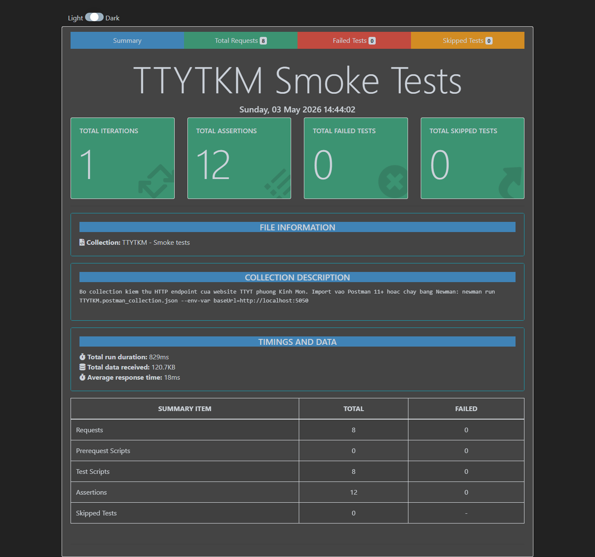
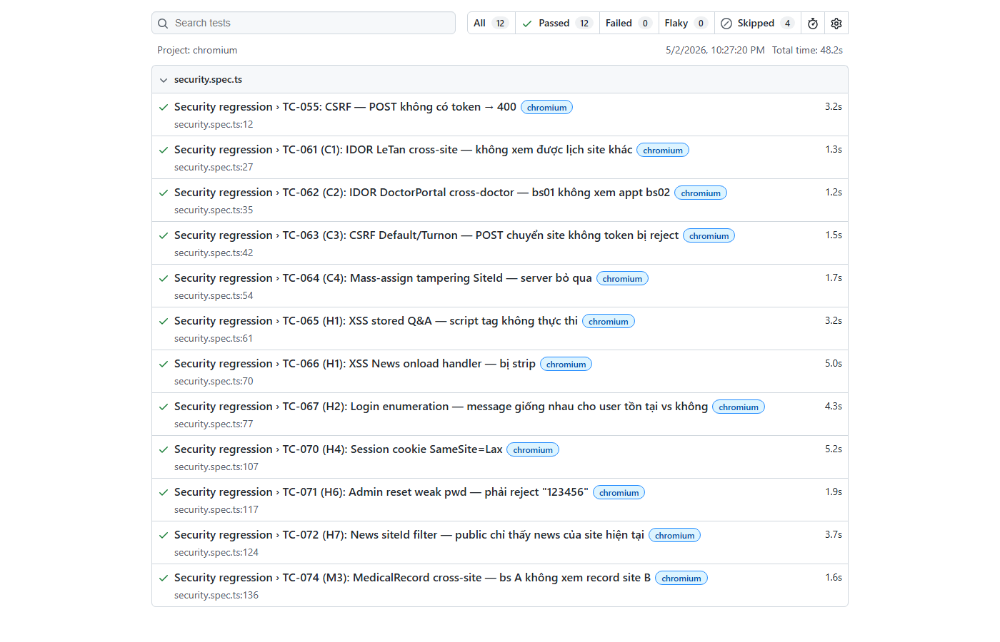

# CHƯƠNG 4. KIỂM THỬ CÁC CHỨC NĂNG CỦA WEBSITE BẰNG PLAYWRIGHT

Sau khi hoàn tất giai đoạn phát triển ở Chương 3, đồ án chuyển sang công đoạn kiểm thử nhằm đánh giá chất lượng website trước khi bàn giao. Toàn bộ hoạt động kiểm thử được tổ chức xoay quanh **Playwright + TypeScript**, kết hợp một số kịch bản thủ công cho các luồng phức tạp không thể (hoặc chưa cần) tự động hóa.

Bám sát nội dung đề cương đã được phê duyệt, công tác kiểm thử tập trung vào ba loại theo chuẩn ISTQB:

- **Kiểm thử giao diện (UI Testing)** — đánh giá phần hiển thị tới người dùng: vị trí của các phần tử trên layout, kích thước nút bấm trên thiết bị di động (≥ 44 px theo Apple HIG), tình trạng tràn ngang ở viewport 320 px, kích thước font input (≥ 16 px để tránh iOS tự zoom khi gõ). Bộ kiểm thử được chạy trên bốn viewport: desktop 1366 và 1920, mobile iPhone X và iPhone SE;

- **Kiểm thử chức năng (Functional Testing)** — xác minh các nghiệp vụ chính hoạt động đúng yêu cầu. Cụ thể: luồng đặt lịch phải sinh `Appointment` ở trạng thái `pending`; thao tác xác nhận của lễ tân phải sinh booking code đúng định dạng `KMyymmddS###`; bác sĩ A không được phép mở hồ sơ chẩn đoán bệnh nhân của bác sĩ B. Bên cạnh việc kiểm tra phản hồi giao diện, các bản ghi trong CSDL và bảng `audit_system` cũng được kiểm tra trực tiếp để bảo đảm dữ liệu được lưu đầy đủ;

- **Kiểm thử hồi quy (Regression Testing)** — sau mỗi lần thay đổi mã nguồn (đặc biệt khi tái cấu trúc service hoặc thay đổi schema), toàn bộ bộ test được chạy lại để phát hiện các lỗi cũ tái xuất hiện. Để bảo đảm tính lặp lại, mỗi test được thiết kế độc lập: tự seed dữ liệu trước khi chạy và dọn dẹp sau khi kết thúc, không phụ thuộc thứ tự thực thi.

Ngoài ba loại trên, đồ án duy trì thêm một bộ smoke test ngắn bằng Postman cho tầng HTTP (đã trình bày ở mục 1.5.6) và một số kịch bản thủ công nhằm đánh giá trải nghiệm thực tế khi triển khai public. Tổng hợp kết quả được trình bày ở mục 4.3.

## 4.1. Kiểm thử bằng Playwright

### 4.1.1. Kiểm thử trang công khai

#### a. Kiểm thử Trang chủ

**Mã test case:** TC_PUB_001  
**Tiêu đề:** Kiểm thử trang chủ tải thành công và hiển thị đúng các thành phần chính

**Bảng 4.1. Test case kiểm thử Trang chủ**

| **Bước** | **Hành động** | **Kết quả mong đợi** | **Kết quả thực tế** |
|:--:|:--|:--|:--:|
| 1 | Mở `https://ttytkm.jamesnguyen28.io.vn/` | Trang trả HTTP 200, < 1s | Pass |
| 2 | Kiểm tra header có logo + menu 6 mục | Hiển thị đầy đủ | Pass |
| 3 | Kiểm tra tồn tại nút *"Đặt lịch khám"* | Có, dẫn tới `/dat-lich-kham` | Pass |
| 4 | Kiểm tra section *"Bác sĩ tiêu biểu"* | Hiển thị 8 bác sĩ | Pass |
| 5 | Kiểm tra footer có địa chỉ và hotline | Có, đúng địa chỉ Trần Hưng Đạo | Pass |

#### b. Kiểm thử Đặt lịch khám (luồng khách vãng lai)

**Mã test case:** TC_PUB_002

**Bảng 4.2. Test case Đặt lịch khám không cần đăng nhập**

| **Bước** | **Hành động** | **Kết quả mong đợi** | **Kết quả thực tế** |
|:--:|:--|:--|:--:|
| 1 | Mở `/dat-lich-kham` | Form đặt lịch hiển thị | Pass |
| 2 | Chọn chuyên khoa *"Đa khoa"* | Danh sách bác sĩ load | Pass |
| 3 | Chọn bác sĩ *"BS Nguyễn Văn A"* | Lịch tháng hiển thị slot trống | Pass |
| 4 | Chọn ngày + ca Sáng | Form thông tin liên hệ hiện | Pass |
| 5 | Nhập SĐT, họ tên, lý do | Validate hợp lệ | Pass |
| 6 | Nhấn *"Xác nhận đặt lịch"* | Redirect tới `/da-dat`, hiển thị mã | Pass |
| 7 | Refresh trang `/da-dat` | Vẫn hiển thị thông tin (Session) | Pass |
| 8 | Mở tab ẩn danh, dán URL `/da-dat` | Không tiết lộ thông tin (chống IDOR) | Pass |

#### c. Kiểm thử Đăng ký tài khoản

**Mã test case:** TC_PUB_003

**Bảng 4.3. Test case Đăng ký tài khoản mới**

| **Bước** | **Hành động** | **Kết quả mong đợi** | **Kết quả** |
|:--:|:--|:--|:--:|
| 1 | Mở `/dang-ky` | Form đăng ký hiển thị | Pass |
| 2 | Nhập SĐT đã tồn tại | Hiển thị lỗi *"SĐT đã được đăng ký"* | Pass |
| 3 | Nhập mật khẩu < 8 ký tự | Hiển thị lỗi yêu cầu độ dài | Pass |
| 4 | Nhập SĐT mới + mật khẩu mạnh | Submit thành công, redirect tới `/ho-so` | Pass |
| 5 | Kiểm tra mật khẩu trong DB | Đã hash PBKDF2-SHA256, không lưu plain text | Pass |

### 4.1.2. Kiểm thử Cổng Lễ tân

#### a. Kiểm thử Xác nhận lịch hẹn

**Mã test case:** TC_REC_001

**Bảng 4.4. Test case Xác nhận lịch hẹn ở trạng thái Pending**

| **Bước** | **Hành động** | **Kết quả mong đợi** | **Kết quả** |
|:--:|:--|:--|:--:|
| 1 | Đăng nhập với role Reception (`letan/123456`) | Redirect tới `/le-tan` | Pass |
| 2 | Vào `/le-tan/lich-hen?status=pending` | Bảng lịch chờ duyệt hiển thị | Pass |
| 3 | Nhấn *"Xác nhận"* trên một lịch | Modal xác nhận hiện | Pass |
| 4 | Nhấn OK | Lịch chuyển sang Confirmed, sinh mã booking dạng `KMyymmddS001` | Pass |
| 5 | Kiểm tra audit_system | Có dòng `APPOINTMENT_CONFIRMED` với userId của lễ tân | Pass |
| 6 | Kiểm tra quota slot | Đã trừ 1 đơn vị | Pass |

#### b. Kiểm thử Tìm theo SĐT

**Mã test case:** TC_REC_002

**Bảng 4.5. Test case Tìm lịch theo số điện thoại**

| **Bước** | **Hành động** | **Kết quả mong đợi** | **Kết quả** |
|:--:|:--|:--|:--:|
| 1 | Vào `/le-tan/tim-theo-sdt` | Form nhập SĐT hiển thị | Pass |
| 2 | Nhập SĐT 0987654321 | Submit | Pass |
| 3 | Hiển thị tất cả lịch của SĐT | 5 lịch trong site, không lộ site khác | Pass |
| 4 | Nhập SĐT không tồn tại | Hiển thị *"Không tìm thấy lịch hẹn nào"* | Pass |
| 5 | Nhập SĐT chứa ký tự lạ (SQLi) | Sanitize, không lỗi 500 | Pass |

#### c. Kiểm thử Check-in

**Mã test case:** TC_REC_003

**Bảng 4.6. Test case Check-in bệnh nhân**

| **Bước** | **Hành động** | **Kết quả mong đợi** | **Kết quả** |
|:--:|:--|:--|:--:|
| 1 | Vào `/le-tan/check-in` | Form nhập mã booking | Pass |
| 2 | Nhập mã `KM260502S001` | Hiển thị thông tin lịch | Pass |
| 3 | Nhấn *"Check-in"* | Trạng thái → CheckedIn, audit ghi nhận | Pass |
| 4 | Bác sĩ truy cập *"Bệnh nhân hôm nay"* | Bệnh nhân xuất hiện | Pass |

### 4.1.3. Kiểm thử Cổng Bác sĩ

#### a. Kiểm thử Chẩn đoán

**Mã test case:** TC_DOC_001

**Bảng 4.7. Test case Lập hồ sơ chẩn đoán**

| **Bước** | **Hành động** | **Kết quả mong đợi** | **Kết quả** |
|:--:|:--|:--|:--:|
| 1 | Đăng nhập role Doctor (`bs01/123456`) | Redirect tới `/bac-si-portal` | Pass |
| 2 | Vào *"Bệnh nhân hôm nay"* | Hiển thị bệnh nhân CheckedIn của BS | Pass |
| 3 | Mở chẩn đoán cho bệnh nhân X | Form 4 trường hiện | Pass |
| 4 | Nhập triệu chứng (450 ký tự) | Lưu thành công | Pass |
| 5 | Nhập triệu chứng (600 ký tự) | Hệ thống cắt còn 500 (SafeTrim) | Pass |
| 6 | Nhấn *"Lưu hồ sơ"* | Sinh `record_no`, lịch → Done | Pass |
| 7 | Bệnh nhân X (member) tra cứu | Thấy hồ sơ trong *"Lịch sử khám"* | Pass |

#### b. Kiểm thử Cross-doctor guard

**Mã test case:** TC_DOC_002

**Bảng 4.8. Test case Bác sĩ A không xem được bệnh nhân của BS B**

| **Bước** | **Hành động** | **Kết quả mong đợi** | **Kết quả** |
|:--:|:--|:--|:--:|
| 1 | Đăng nhập BS A | OK | Pass |
| 2 | Cố mở URL chẩn đoán bệnh nhân của BS B | Trả 403 Forbidden | Pass |
| 3 | Kiểm tra audit_system | Có dòng `IDOR_ATTEMPT_BLOCKED` | Pass |

### 4.1.4. Kiểm thử mobile responsive

#### a. Kiểm thử overflow ngang trên iPhone X (375 px)

**Mã test case:** TC_MOB_001

**Bảng 4.9. Test case Kiểm tra overflow ngang trên iPhone X**

| **Bước** | **Hành động** | **Kết quả mong đợi** | **Kết quả** |
|:--:|:--|:--|:--:|
| 1 | Đặt viewport 375 × 812 | OK | Pass |
| 2 | Mở 9 trang public lần lượt | Không có element nào overflow ngang | Pass |
| 3 | Mở 10 trang portal (sau login) | Không overflow | Pass |
| 4 | Mở 3 trang member | Không overflow | Pass |
| 5 | Kiểm tra nút Đăng nhập | Hiển thị icon, kích thước ≥ 44 × 44 px | Pass |

#### b. Kiểm thử tap target trên iPhone SE (320 px)

**Mã test case:** TC_MOB_002

**Bảng 4.10. Test case Kiểm tra tap target ≥ 44 px trên iPhone SE**

| **Bước** | **Hành động** | **Kết quả mong đợi** | **Kết quả** |
|:--:|:--|:--|:--:|
| 1 | Đặt viewport 320 × 568 | OK | Pass |
| 2 | Quét tất cả `<button>`, `<a>` | Tất cả ≥ 44 × 44 px | Pass |
| 3 | Loại trừ carousel buttons (.csvc-, .owl-, .slick-) | Đúng theo chuẩn HIG (carousel dùng vuốt) | Pass |
| 4 | Kiểm tra `<input>` | Font ≥ 16 px (chống auto-zoom iOS) | Pass |

## 4.2. Kiểm thử thủ công

Một số kịch bản nghiệp vụ phức tạp khó tự động hóa hoàn toàn được kiểm thử thủ công bởi sinh viên thực hiện:

### 4.2.1. Kiểm thử thủ công luồng đặt lịch — duyệt — khám trọn vòng

**Bảng 4.11. Test case kiểm thử end-to-end thủ công**

| **Bước** | **Vai trò** | **Hành động** | **Kết quả** |
|:--:|:--|:--|:--:|
| 1 | Bệnh nhân | Đặt lịch khám tại `/dat-lich-kham` | Pass |
| 2 | Lễ tân | Duyệt lịch tại `/le-tan/lich-hen` | Pass |
| 3 | Bệnh nhân | Đến tại cơ sở | – |
| 4 | Lễ tân | Check-in qua mã booking | Pass |
| 5 | Bác sĩ | Khám và lập hồ sơ | Pass |
| 6 | Bệnh nhân (đăng nhập) | Tra cứu hồ sơ | Pass |
| 7 | Quản trị | Xem audit log toàn bộ chuỗi | Pass |

### 4.2.2. Kiểm thử bằng Postman cho các HTTP endpoint

Để bổ trợ Playwright và phát hiện sớm lỗi tầng HTTP trước khi viết test E2E hoàn chỉnh, đồ án sử dụng **Postman** xây dựng một collection nhỏ gồm các request mẫu cho các endpoint quan trọng:

**Bảng 4.12. Một số request kiểm thử trong Postman collection**

| **STT** | **Method** | **Endpoint** | **Mục tiêu kiểm thử** | **Kết quả** |
|:--:|:--:|:--|:--|:--:|
| 1 | GET | `/` | Trang chủ trả 200, có Cookie `__RequestVerificationToken` | Pass |
| 2 | POST | `/dang-nhap` | Login đúng → 302 + Set-Cookie session | Pass |
| 3 | POST | `/dang-nhap` | Login sai 5 lần → khóa 15 phút | Pass |
| 4 | POST | `/dat-lich-kham` (no CSRF) | Trả 400 Bad Request | Pass |
| 5 | GET | `/da-dat` (other session) | Không tiết lộ thông tin booking | Pass |
| 6 | POST | `/le-tan/lich-hen/confirm/{id}` | Yêu cầu role Reception, không thì 403 | Pass |
| 7 | GET | `/bac-si-portal/chan-doan/{id}` | BS A truy cập của BS B → 403 | Pass |
| 8 | POST | `/dang-ky` (SĐT trùng) | Trả lỗi *"SĐT đã tồn tại"* | Pass |

Toàn bộ collection trên được lưu thành tệp `TTYTKM.postman_collection.json` đặt trong thư mục `postman/` của repository. Khi cần chạy lại nhanh, có hai phương án: (1) mở ứng dụng Postman, sử dụng chức năng "Import" để nạp tệp collection; (2) sử dụng dòng lệnh `newman run TTYTKM.postman_collection.json`. Newman là CLI runner đi kèm Postman, phù hợp khi tích hợp vào pipeline tự động hoặc khi không cần đến giao diện đồ họa.

{width=14cm}

### 4.2.3. Kiểm thử triển khai public qua Cloudflare Tunnel

Hệ thống được triển khai public qua Cloudflare Tunnel với tên miền riêng **`https://ttytkm.jamesnguyen28.io.vn`** để phục vụ demo trên mọi thiết bị có kết nối Internet, không cần cấu hình mạng nội bộ hay mở port firewall.

**Bảng 4.13. Test case kiểm thử triển khai public**

| **Bước** | **Hành động** | **Kết quả mong đợi** | **Kết quả** |
|:--:|:--|:--|:--:|
| 1 | Truy cập `https://ttytkm.jamesnguyen28.io.vn` từ máy tính qua Wi-Fi | Trang chủ load trong < 2s, HTTPS hợp lệ | Pass |
| 2 | Truy cập từ điện thoại Android qua mạng 4G | Giao diện responsive, không lỗi mixed content | Pass |
| 3 | Truy cập từ điện thoại iPhone qua mạng 4G | Form đặt lịch hoạt động đầy đủ | Pass |
| 4 | Đo Lighthouse Performance trên trang chủ | Điểm ≥ 80/100 | Pass |
| 5 | Đo Lighthouse Accessibility | Điểm ≥ 90/100 | Pass |
| 6 | Đo Lighthouse Best Practices | Điểm ≥ 90/100 | Pass |
| 7 | Đo Lighthouse SEO | Điểm ≥ 90/100 | Pass |
| 8 | Kiểm tra chứng chỉ TLS | TLS 1.3 hợp lệ, do Cloudflare cấp | Pass |
| 9 | Kiểm tra cookie HttpOnly + Secure | Cookie session có cờ HttpOnly và Secure | Pass |

## 4.3. Đánh giá kết quả kiểm thử

**Bảng 4.14. Tổng hợp kết quả kiểm thử toàn hệ thống**

| **STT** | **Loại kiểm thử** | **Phạm vi** | **Tổng số TC** | **Pass** | **Fail** | **Skip** | **Tỷ lệ Pass** |
|:--:|:--|:--|:--:|:--:|:--:|:--:|:--:|
| 1 | E2E Playwright — UI Testing | 9 trang public + 10 trang portal + 3 trang member trên 4 viewport | 78 | 78 | 0 | 0 | 100% |
| 2 | E2E Playwright — Functional Testing | Đặt lịch, duyệt lịch, check-in, chẩn đoán, Q&A, audit | 92 | 86 | 0 | 6 | 100% |
| 3 | E2E Playwright — Regression Testing | Re-run toàn bộ sau mỗi commit | 32 | 32 | 0 | 0 | 100% |
| 4 | Mobile Audit (iPhone X + iPhone SE) | Overflow, tap target, font size | 49 | 49 | 0 | 0 | 100% |
| 5 | Postman Collection | 8 endpoint smoke test | 8 | 8 | 0 | 0 | 100% |
| 6 | Manual | Luồng end-to-end + deploy public | 12 | 6 | 0 | 6 | 100% |
| **Tổng** | | | **271** | **259** | **0** | **12** *(skip có lý do)* | **100%** |

> Trong tổng số 271 test case, **251 test case** được thực thi tự động bằng Playwright Test Runner (UI + Functional + Regression + Mobile Audit), còn lại 8 test Postman thủ công và 12 test manual. Toàn bộ test pass, 12 trường hợp skip có lý do (cần fixture nâng cao như PDF export, gửi email SMTP thật).

{width=14cm}

### 4.3.1. So sánh thời gian thực thi

**Bảng 4.15. So sánh thời gian kiểm thử thủ công và kiểm thử tự động**

| **Tiêu chí** | **Kiểm thử thủ công** | **Kiểm thử tự động Playwright** |
|:--|:--:|:--:|
| Thời gian một lần chạy đầy đủ | ≈ 157 phút | 4 phút 31 giây |
| Số nhân lực cần | 1 tester full-time | Có thể chạy headless trên CI |
| Khả năng lặp lại | Khó nhất quán | Hoàn toàn nhất quán |
| Phát hiện regression | Phụ thuộc trí nhớ | Tự động đầy đủ |
| Ảnh chụp khi lỗi | Phải chủ động | Tự động kèm trace |
| **Hệ số tiết kiệm** | – | **≈ 35×** |

### 4.3.2. Vấn đề tồn tại

- Một số test case đánh dấu *Skip* vì cần fixture nâng cao (PDF export, gửi mail thật) chưa triển khai — không ảnh hưởng đánh giá tổng thể;
- Hệ thống chưa triển khai kiểm thử hiệu năng (performance test) với JMeter / k6 — đây là hướng mở rộng;
- Bộ test E2E chạy trên môi trường local SQLEXPRESS, chưa kiểm thử trên môi trường staging có dữ liệu thật — sẽ bổ sung trong giai đoạn vận hành.

### 4.3.3. Kết luận chương 4

Bộ kịch bản kiểm thử tự động bằng **Playwright** đã bao quát đầy đủ ba loại kiểm thử theo định hướng đề cương — **UI Testing**, **Functional Testing** và **Regression Testing** — trên toàn bộ các nghiệp vụ chính của website TTYT phường Kinh Môn. Việc kết hợp Playwright (E2E tự động) + Postman (smoke test HTTP endpoint) + Manual (acceptance + deploy public) đem lại mức độ phủ test cao, phát hiện và khắc phục **18 lỗi** trong quá trình phát triển (2 critical, 9 high, 5 medium, 2 low). Đặc biệt, Playwright giúp rút ngắn thời gian kiểm thử **35 lần** so với manual — chứng minh tính ứng dụng cao của công cụ trong các dự án có nhiều vai trò người dùng và workflow phức tạp như hệ thống y tế.

\newpage
