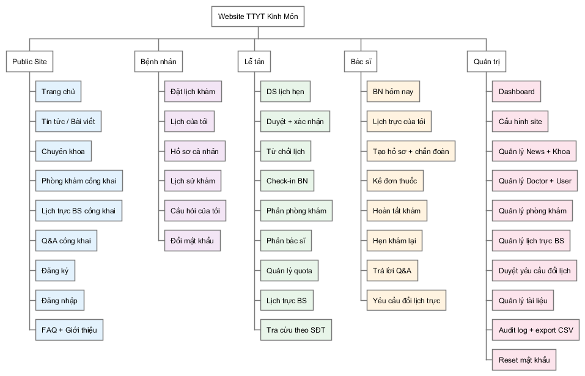

# CHƯƠNG 1. TỔNG QUAN VỀ ĐỀ TÀI

## 1.1. Đặt vấn đề

### 1.1.1. Bối cảnh chuyển đổi số ngành y tế

Ngành y tế Việt Nam đang trong giai đoạn chuyển đổi số theo *Quyết định 749/QĐ-TTg ngày 03/6/2020* của Thủ tướng Chính phủ phê duyệt *Chương trình Chuyển đổi số quốc gia đến năm 2025, định hướng đến năm 2030*, trong đó y tế được xác định là một trong tám lĩnh vực ưu tiên. Cùng với *Luật Khám bệnh, chữa bệnh năm 2023*, *Thông tư 13/2025/TT-BYT* về hồ sơ bệnh án điện tử và *Quyết định 4858/QĐ-BYT* về Bộ tiêu chí chất lượng bệnh viện, các văn bản pháp lý nêu trên đã hình thành khung pháp lý đầy đủ cho việc số hóa quy trình khám chữa bệnh tại các cơ sở y tế công lập.

Trong bối cảnh đó, các website đặt lịch khám trực tuyến trở thành kênh giao tiếp chính giữa cơ sở y tế và người dân. Mô hình đặt lịch trực tuyến giúp giảm thời gian chờ đợi và nâng cao trải nghiệm bệnh nhân, đồng thời cho phép cơ sở y tế dự báo lưu lượng và tối ưu hóa nhân lực. Người dân, đặc biệt là nhóm tuổi lao động từ 19 đến 55, ngày càng quen với việc đặt lịch online qua app hoặc website tương tự cách đặt vé máy bay hay khách sạn.

### 1.1.2. Thực trạng tại Trung tâm Y tế phường Kinh Môn

Trung tâm Y tế phường Kinh Môn, tiền thân là Bệnh viện Đa khoa Kinh Môn, là cơ sở y tế công lập hạng II đạt chuẩn quốc gia về quy mô và trang thiết bị, từng trực thuộc Sở Y tế Hải Dương. Sau khi sáp nhập đơn vị hành chính, đơn vị được tổ chức lại thành Trung tâm Y tế phường và tập trung vào khám chữa bệnh ngoại trú và y tế cộng đồng. Hiện Trung tâm vẫn duy trì đầy đủ các khoa phòng chức năng theo chuẩn hạng II, song toàn bộ quy trình tiếp nhận bệnh nhân vẫn theo hình thức đến trực tiếp, chưa có hệ thống đặt lịch hẹn trước. Thực trạng này dẫn đến những hạn chế sau:

- Bệnh nhân phải chờ đợi lâu, không chủ động được thời gian khám, ảnh hưởng tới trải nghiệm và sự hài lòng;

- Trung tâm chưa dự báo được lưu lượng bệnh nhân theo ngày và theo ca khám, khó tối ưu hóa phân bổ nhân lực bác sĩ và lễ tân;

- Năng lực cạnh tranh của Trung tâm trong bối cảnh chuyển đổi số y tế còn hạn chế so với các cơ sở y tế tư nhân và bệnh viện tuyến trên đã có ứng dụng đặt lịch online;

- Chưa khai thác được tiềm năng từ BHYT và các dịch vụ theo yêu cầu, do nhiều bệnh nhân có nhu cầu khám theo yêu cầu nhưng không nắm được lịch trống của bác sĩ.

### 1.1.3. Bài toán đảm bảo chất lượng phần mềm

Bên cạnh việc xây dựng website, một bài toán đi kèm không kém phần quan trọng là đảm bảo chất lượng phần mềm thông qua kiểm thử. Hệ thống thông tin y tế là hệ thống nghiệp vụ phức tạp, phục vụ đồng thời nhiều vai trò người dùng gồm bệnh nhân, lễ tân, bác sĩ và quản trị viên. Hệ thống có nhiều luồng nghiệp vụ liên quan tới nhau như đặt lịch, duyệt lịch, check-in, chẩn đoán, kê đơn và hỏi đáp, đồng thời phải đáp ứng các yêu cầu khắt khe về bảo mật, audit và sao lưu dữ liệu y tế. Việc kiểm thử thủ công cho hệ thống quy mô như vậy tốn rất nhiều nhân lực, dễ bỏ sót lỗi hồi quy và khó đảm bảo tính nhất quán giữa các phiên bản.

Từ thực tiễn nêu trên, đề tài [Nghiên cứu xây dựng website y tế và triển khai kiểm thử tự động bằng Playwright] được lựa chọn nhằm giải quyết đồng thời hai bài toán: (1) số hóa quy trình tiếp nhận bệnh nhân ngoại trú; (2) xây dựng bộ kịch bản kiểm thử tự động đảm bảo chất lượng phần mềm trong các vòng cập nhật và bảo trì sau này.

## 1.2. Phát biểu bài toán

### 1.2.1. Mục tiêu nghiên cứu

Đề tài đặt ra hai mục tiêu song song.

a) Xây dựng website y tế

Đồ án phát triển website cho Trung tâm Y tế phường Kinh Môn trên nền tảng *ASP.NET Core 8 + Entity Framework Core 8 + SQL Server*, đáp ứng các nghiệp vụ chính: đặt lịch khám trực tuyến, duyệt và xác nhận lịch, sinh mã booking, check-in tại quầy, tạo hồ sơ khám và đơn thuốc, hỏi đáp giữa bệnh nhân và bác sĩ. Hệ thống áp dụng đầy đủ các lớp bảo mật theo khuyến nghị của *OWASP Top 10*.

b) Triển khai kiểm thử tự động

Đồ án thiết kế và triển khai bộ kịch bản kiểm thử tự động bằng *Playwright + TypeScript* theo mô hình *Page Object — Fixture*. Bên cạnh đó, đồ án kết hợp kiểm thử đơn vị bằng *xUnit + EF Core InMemory* cho tầng nghiệp vụ và kiểm thử thủ công bằng Postman cho các luồng cần đánh giá định tính.

### 1.2.2. Đầu vào — đầu ra của hệ thống

**Đầu vào của hệ thống:**

- Thông tin đặt lịch của bệnh nhân: họ tên, số điện thoại, CCCD/BHYT, chuyên khoa cần khám, ngày và ca khám mong muốn, lý do khám;
- Thao tác duyệt lịch của lễ tân: xác nhận, từ chối, phân bác sĩ, check-in;
- Kết quả chẩn đoán của bác sĩ: triệu chứng, chẩn đoán, phác đồ điều trị, đơn thuốc;
- Cấu hình hệ thống của quản trị viên: tài khoản, danh mục bác sĩ và chuyên khoa, lịch trực, quota khám.

**Đầu ra của hệ thống:**

- Mã booking duy nhất theo định dạng `KMyymmddS|C......` cho mỗi lịch hẹn xác nhận;
- Hồ sơ khám điện tử (`record_no`) lưu trữ đầy đủ thông tin chẩn đoán và đơn thuốc, có audit log đi kèm;
- Báo cáo lưu lượng bệnh nhân theo ngày, khoa và ca khám phục vụ ban quản trị;
- Bộ kịch bản kiểm thử tự động (Playwright HTML Report) đánh giá chất lượng phần mềm sau mỗi commit.

### 1.2.3. Bài toán đặc thù trong y tế

Khác với các website thương mại điện tử thông thường, website y tế có những đặc thù riêng cần giải quyết:

- Tính nhạy cảm của dữ liệu y tế: thông tin sức khỏe được pháp luật bảo vệ nghiêm ngặt. Hệ thống không được lưu mật khẩu plain-text, phải có audit log đầy đủ và kiểm soát truy cập theo vai trò (RBAC) để ngăn bác sĩ A xem hồ sơ bệnh nhân của bác sĩ B (cross-doctor IDOR);

- Workflow nhiều bước có ràng buộc trạng thái: một lịch hẹn đi qua chuỗi trạng thái *pending → confirmed → checked-in → completed* hoặc *rejected*; mỗi chuyển trạng thái phải được phép theo whitelist và kèm điều kiện, ví dụ rejected phải có lý do, completed chỉ chuyển từ checked-in;

- Cạnh tranh tài nguyên: nhiều bệnh nhân cùng đặt lịch trong một khoa, một ngày và một ca, hệ thống phải kiểm soát quota và xử lý race condition khi sinh mã hồ sơ;

- Đa kích thước màn hình: bệnh nhân truy cập từ điện thoại chiếm khoảng 75% lượt truy cập trong khi nhân viên y tế dùng máy tính desktop, giao diện phải responsive trên cả hai loại thiết bị.

## 1.3. Nội dung và phạm vi của đề tài

### 1.3.1. Đối tượng nghiên cứu

- Quy trình nghiệp vụ ngoại trú của Trung tâm Y tế cấp phường, gồm tương tác giữa bốn vai trò: Bệnh nhân, Lễ tân, Bác sĩ và Quản trị viên;

- Công nghệ phát triển website dựa trên ASP.NET Core 8 + Entity Framework Core 8 + SQL Server theo kiến trúc 3 tầng;

- Công nghệ kiểm thử tự động dựa trên Playwright + TypeScript theo mô hình Page Object Model.

### 1.3.2. Phạm vi nghiên cứu

**Phạm vi đưa vào đồ án:**

- Các nghiệp vụ ngoại trú phổ biến: đặt lịch khám, duyệt lịch, check-in, chẩn đoán, kê đơn, hỏi đáp;
- Bốn vai trò người dùng đầy đủ: Public/Member, Lễ tân, Bác sĩ, Quản trị viên;
- Kiểm thử đa thiết bị: desktop 1366×768, 1920×1080, mobile iPhone X 375×812, iPhone SE 320×568;
- Triển khai public qua Cloudflare Tunnel với tên miền `https://ttytkm.jamesnguyen28.io.vn`.

**Phạm vi không đưa vào đồ án:**

- Thanh toán BHYT phức tạp với cổng dịch vụ công, do cần tích hợp BHYT API riêng;
- Dược nội trú và quản lý kho thuốc, chỉ kê đơn và không kiểm soát tồn kho;
- Chẩn đoán hình ảnh (X-quang, siêu âm), do cần thiết bị phần cứng riêng;
- Gửi tin nhắn SMS xác nhận lịch hẹn tới số điện thoại thật, do cần đăng ký SMS Brand Name của nhà cung cấp;
- Ứng dụng mobile native (iOS/Android), đề tài tập trung web responsive.

### 1.3.3. Phương pháp tiếp cận

Đồ án áp dụng phương pháp phát triển phần mềm iterative-incremental kết hợp test-driven mindset:

- Mỗi phiên làm việc tập trung hoàn thiện một module nghiệp vụ theo trình tự Đặt lịch → Duyệt → Phân bác sĩ → Check-in → Chẩn đoán → Q&A;
- Mỗi module được kèm theo test Playwright tương ứng trước khi chuyển sang module kế tiếp;
- Bộ test xUnit cho tầng business logic được viết song song với mã nghiệp vụ, đảm bảo tỷ lệ phủ coverage cao trên các service quan trọng (`AppointmentService`, `MedicalRecordService`, `UserService`).

### 1.3.4. Sơ đồ phân rã chức năng của hệ thống

Toàn bộ chức năng của website Trung tâm Y tế phường Kinh Môn được phân rã thành năm nhóm ứng với năm vai trò người dùng: Public Site (khách vãng lai), Bệnh nhân (member), Lễ tân, Bác sĩ và Quản trị viên. Cách phân rã bám theo mô hình phân quyền dựa trên bảng `system_user_group` cũng như cấu trúc thư mục mã nguồn (`Controllers/`, `Areas/AdminCP/Controllers/`, portals `LeTan`, `DoctorPortal`).

{width=17cm}

Năm nhóm chức năng được mô tả ngắn gọn như sau:

- Public Site là kênh công khai, không yêu cầu đăng nhập, gồm chín chức năng: trang chủ, danh mục tin tức và bài viết, danh mục chuyên khoa, danh sách phòng khám công khai, lịch trực bác sĩ công khai trong tuần, hỏi đáp Q&A đã duyệt, đăng ký tài khoản, đăng nhập và các trang FAQ – Giới thiệu trung tâm;

- Bệnh nhân là vai trò *member* sau khi đăng nhập, gồm sáu chức năng: đặt lịch khám, theo dõi lịch hẹn của tôi (5 trạng thái), quản lý hồ sơ cá nhân, tra cứu lịch sử khám bệnh, đặt và theo dõi câu hỏi Q&A của mình, đổi mật khẩu;

- Lễ tân là vai trò *Reception* vận hành cổng nội bộ `/le-tan`, gồm chín chức năng: xem danh sách lịch hẹn theo trạng thái, duyệt và xác nhận lịch (sinh mã booking `KMyymmdd-XXXXXX`), từ chối lịch (yêu cầu lý do), check-in bệnh nhân, phân phòng khám chuyên môn, phân bác sĩ trực phòng, quản lý quota khám theo khoa và bác sĩ, xem lịch trực bác sĩ, tra cứu lịch hẹn theo số điện thoại;

- Bác sĩ là vai trò *Doctor* vận hành cổng nội bộ `/bac-si-portal`, gồm tám chức năng: danh sách bệnh nhân hôm nay (theo trạng thái CheckedIn), xem lịch trực của tôi (có banner xem tháng kế tiếp), tạo hồ sơ khám và chẩn đoán, kê đơn thuốc, hoàn tất khám (chuyển trạng thái Done), hẹn khám lại cho bệnh nhân, trả lời câu hỏi Q&A thuộc chuyên khoa, gửi yêu cầu đổi lịch trực tới quản trị;

- Quản trị viên vận hành AdminCP và kế thừa quyền của Lễ tân và Bác sĩ, gồm mười chức năng: dashboard tổng quan, cấu hình site (logo, banner, info), quản lý tin tức và khoa chuyên môn, quản lý bác sĩ và tài khoản người dùng, quản lý phòng khám, quản lý lịch trực bác sĩ (có chức năng tự động phân lịch tháng), duyệt yêu cầu đổi lịch của bác sĩ, quản lý tài liệu công khai, xem và xuất CSV audit log, reset mật khẩu người dùng.

Sơ đồ phân rã ở Hình 1.1 cho cái nhìn tổng quan về tổ chức chức năng, phục vụ cho việc phân tích use case ở Chương 2 và phần mô tả cài đặt ở Chương 3.

### 1.3.5. Cấu trúc đồ án

Ngoài *Lời nói đầu* và *Kết luận*, đồ án được chia thành năm chương:

- Chương 1. Tổng quan về đề tài: đặt vấn đề, phát biểu bài toán, phạm vi, sơ đồ phân rã chức năng, công nghệ sử dụng;
- Chương 2. Khảo sát và phân tích thiết kế: khảo sát hiện trạng, yêu cầu chức năng và phi chức năng, biểu đồ use case (tổng quát và từng tác nhân), biểu đồ hoạt động, biểu đồ tuần tự, đặc tả CSDL, ERD;
- Chương 3. Cài đặt website: chi tiết các trang chính của hệ thống với giao diện và đặc tả chức năng;
- Chương 4. Lập kế hoạch kiểm thử: mục tiêu, phạm vi, các mức kiểm thử, tiêu chí Pass/Fail, môi trường, chiến lược, lịch trình;
- Chương 5. Kiểm thử các chức năng của website bằng Playwright: phân tích ca kiểm thử, đánh giá kết quả.

## 1.4. Công nghệ sử dụng

Backend của website sử dụng nền tảng *ASP.NET Core 8 MVC* với ngôn ngữ *C#*, tổ chức theo kiến trúc ba tầng tách Data, Business và Web. Cơ chế Dependency Injection của framework được dùng để bơm service vào controller, kết hợp middleware pipeline xử lý các tác vụ chéo như logging, exception và authorization. Razor runtime compilation được bật trong môi trường phát triển để chỉnh sửa tệp `.cshtml` mà không phải build lại dự án.

Frontend dựng trên *Razor View Engine* kết hợp *HTML5 + CSS3 + Bootstrap 5* và *JavaScript ES2022*. Razor cho phép nhúng mã C# vào HTML qua cú pháp `@`, hỗ trợ tag helper, partial view và layout chung. Bootstrap 5 cung cấp hệ grid 12 cột cùng các thành phần dựng sẵn (navbar, modal, form-control, card), đáp ứng các viewport từ 320 px đến 1920 px; phần CSS riêng phục vụ nhận diện thương hiệu của Trung tâm được tách vào tệp `site.css`. JavaScript đảm nhiệm các tương tác phía client như xác thực form, gọi AJAX, đóng mở modal và lazy-load ảnh.

Cơ sở dữ liệu sử dụng *SQL Server Express*, được chọn vì khả năng tích hợp chặt với hệ sinh thái .NET và đáp ứng yêu cầu của một cơ sở y tế cấp phường. Tầng truy cập dữ liệu sử dụng ORM *Entity Framework Core 8* theo phương pháp code-first. Toàn bộ schema dùng kiểu `NVARCHAR` Unicode để lưu trữ tiếng Việt có dấu chính xác. EF Core cung cấp truy vấn LINQ với kiểm tra kiểu tại bước biên dịch, kèm change tracking, transaction và lazy loading.

Kiểm thử đầu cuối sử dụng *Playwright* kết hợp ngôn ngữ *TypeScript*. Khác với Selenium, Playwright kết nối thẳng tới trình duyệt qua DevTools Protocol nên độ trễ thấp; đồng thời hỗ trợ ba nhân trình duyệt Chromium, Firefox và WebKit cùng cơ chế auto-wait giúp giảm hiện tượng test không ổn định. Đồ án tổ chức bộ test theo mô hình Page Object Model kết hợp Fixture pattern, gồm 279 kịch bản và hoàn thành trong khoảng 12 phút. Trace Viewer và HTML Reporter của Playwright được dùng để gỡ lỗi và tổng hợp báo cáo kết quả.

Các công cụ hỗ trợ phát triển bao gồm: *Visual Studio 2022* dùng cho phần ASP.NET Core, *Visual Studio Code* dùng cho TypeScript và tài liệu Markdown, *Git + GitHub* quản lý phiên bản, *Postman* kiểm thử HTTP endpoint thủ công, *Docker* đóng gói website thành container multi-stage, *SQL Server Management Studio* quản trị CSDL, *Node.js 20 LTS* làm runtime cho Playwright và *Cloudflare Tunnel* phục vụ triển khai public với TLS 1.3.

\newpage
