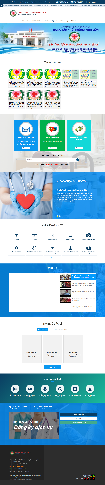
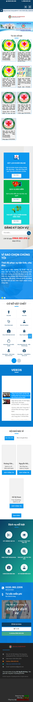
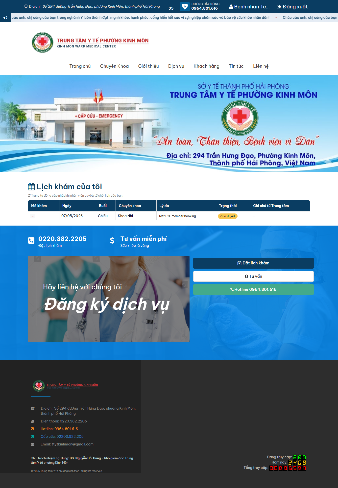
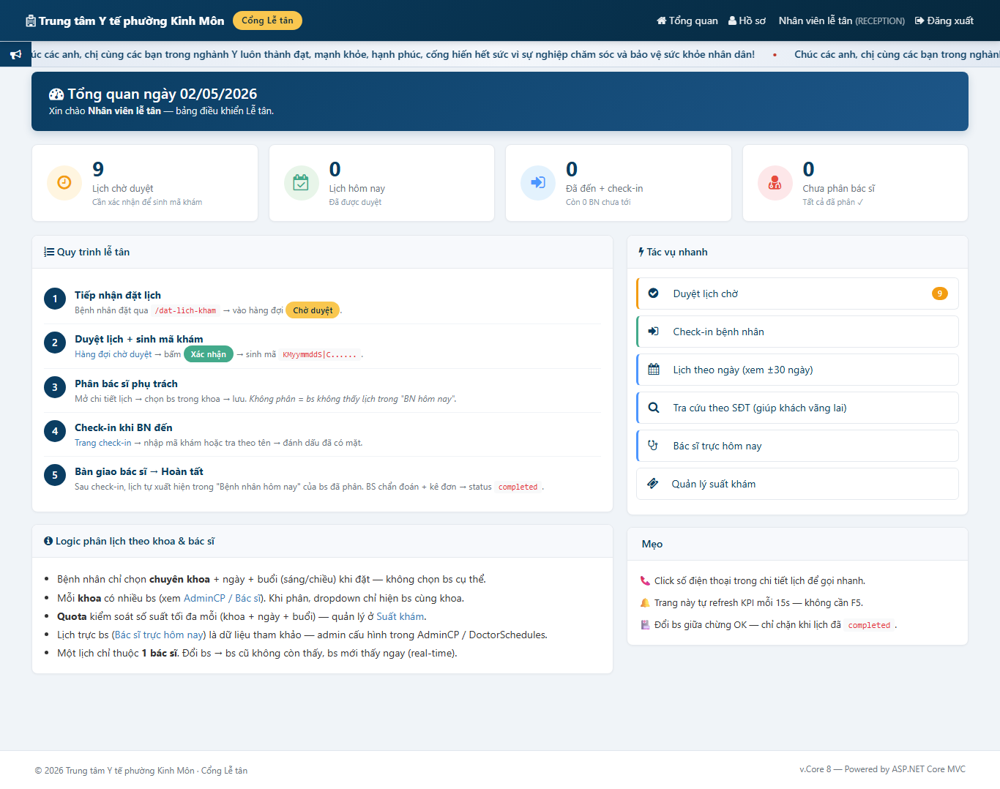
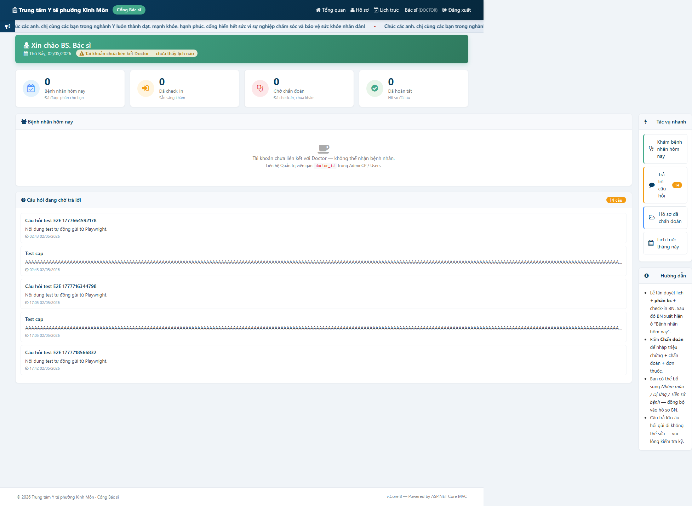

# CHƯƠNG 3. CÀI ĐẶT WEBSITE

## 3.1. Kiến trúc hệ thống

Hệ thống được tổ chức theo mô hình ba tầng gồm Web, Business và Data. Solution `WebsiteCore` chia thành ba project tương ứng cùng một project test.

```
SourceCodeTTYTKM/
├── WebsiteCore/
│   ├── src/
│   │   ├── WebsiteCore.Data/          Entities + DbContext (EF Core)
│   │   ├── WebsiteCore.Business/      Services + ViewModels
│   │   └── WebsiteCore.Web/           MVC + Razor + AdminCP area
│   └── tests/
│       └── WebsiteCore.Tests/         xUnit
├── tests/playwright/                  E2E Playwright + TypeScript
├── docs/                              Tài liệu báo cáo và sơ đồ
└── full_test.sh                       Bash functional smoke test
```

Tầng Data gồm 23 entity ánh xạ tới 23 bảng trong cơ sở dữ liệu `ttytlp`, kèm lớp `WebsiteCoreDbContext`. Một số entity chính: `Site`, `SystemUser`, `Doctor`, `Department`, `ClinicRoom`, `Appointment`, `MedicalRecord`, `QaQuestion`, `QaAnswer`, `AuditSystem`. Ràng buộc khoá ngoại và chỉ mục được khai báo qua Fluent API trong `OnModelCreating`.

Tầng Business gồm các service nghiệp vụ và lớp ViewModel. Các service chính: `AppointmentService` (máy trạng thái lịch hẹn), `MedicalRecordService` (cấp số hồ sơ chống race), `UserService` (đăng ký, đăng nhập, hash mật khẩu), `QnaService` (hỏi đáp), `AuditService` (ghi log thay đổi trạng thái). Mỗi service được đăng ký dependency injection trong `Program.cs` và nhận `DbContext` qua constructor.

Tầng Web theo mô hình MVC, chia thành ba khu vực: controller công khai (Home, Appointment, Qna, Auth), portal cho Lễ tân và Bác sĩ (`/le-tan`, `/bac-si-portal`), và area AdminCP. Các controller kế thừa `BaseController` để gắn `ViewBag.Site`, `ViewBag.CurrentUser`, `ViewBag.Locate`. Action trong AdminCP được bảo vệ bởi filter `StaffAuthorize` để kiểm tra session và phân quyền theo nhóm.

Bảng 3.1. Một số bộ Controller, Service và Entity chính

| Vai trò | Controller | Service | Entity tham gia |
|:--|:--|:--|:--|
| Public | `HomeController`, `AppointmentController` | `AppointmentService`, `NewsService` | `News`, `Doctor`, `Department`, `Appointment` |
| Member | `MemberController`, `AuthController` | `UserService`, `AppointmentService` | `SystemUser`, `Appointment`, `MedicalRecord` |
| Lễ tân | `LeTanController` | `AppointmentService`, `AuditService` | `Appointment`, `ClinicRoom`, `AuditSystem` |
| Bác sĩ | `DoctorPortalController` | `MedicalRecordService`, `QnaService` | `MedicalRecord`, `QaQuestion`, `Appointment` |
| AdminCP | `DepartmentsController`, `DoctorsController`, `UsersController`, `SitesController`, `DoctorSchedulesController`, `MedicalRecordsController` | `AuditService`, `ScheduleService` | Toàn bộ 23 entity |

## 3.2. Triển khai việc xây dựng

Phần backend dùng Visual Studio 2022 để soạn mã C#, gỡ lỗi qua IIS Express, chạy Unit Test bằng Test Explorer và quản lý migration EF Core qua Package Manager Console. Phần Playwright TypeScript và các tệp Markdown dùng Visual Studio Code.

Mã nguồn lưu trên GitHub tại `JamesNguyen281/SourceCodeTTYTKM`, nhánh chính `main` chứa mã ổn định, nhánh tính năng được tạo khi cần thử nghiệm thay đổi lớn. Cơ sở dữ liệu quản lý bằng EF Core 8.0.10 theo code-first; mỗi lần đổi entity sinh migration bằng `dotnet ef migrations add <Tên>` rồi áp dụng bằng `dotnet ef database update`. Razor runtime compilation được bật và Central Package Management khai báo trong `Directory.Packages.props` để đồng bộ phiên bản NuGet.

## 3.3. Trang chủ

Trang chủ là điểm vào chính của website. Bố cục gồm header (logo + menu sáu mục + nút *Đặt lịch khám*), hero banner, bốn ô dịch vụ (Khám tổng quát, Sản – Nhi, Tiêm chủng, Cấp cứu), danh sách tám bác sĩ tiêu biểu, sáu tin tức mới nhất và footer với địa chỉ, hotline, email và bản đồ Google Maps. Trên mobile, menu thu gọn thành nút hamburger và các ô dịch vụ xếp dọc.

{width=16cm}

{width=9cm}

Bảng 3.2. Đặc tả chức năng Trang chủ

| STT | Thành phần | Mô tả |
|:--:|:--|:--|
| 1 | Header logo | Hiển thị logo + tên *Trung tâm Y tế phường Kinh Môn*, click trở về trang chủ |
| 2 | Menu chính | 6 mục: Trang chủ, Bác sĩ, Chuyên khoa, Tin tức, Hỏi đáp, Liên hệ |
| 3 | Nút *Đặt lịch khám* | Nổi bật ở header, dẫn tới `/dat-lich-kham` |
| 4 | Nút Đăng nhập / Đăng ký | Hiển thị bên phải header khi chưa đăng nhập |
| 5 | Hero banner | Ảnh kích thước lớn của Trung tâm, kèm slogan |
| 6 | Khu vực giới thiệu | 4 ô icon: Khám tổng quát, Sản – Nhi, Tiêm chủng, Cấp cứu |
| 7 | Danh sách bác sĩ tiêu biểu | Hiển thị 8 bác sĩ đang hoạt động, click vào xem chi tiết |
| 8 | Tin tức mới nhất | 6 bài viết mới nhất, sắp xếp theo `published_at` giảm dần |
| 9 | Bộ đếm khách trực tuyến | Hiển thị số phiên đang hoạt động trong 15 phút gần nhất |
| 10 | Footer | Địa chỉ 294 Trần Hưng Đạo, hotline 0220.3.822.205, email, bản đồ Google Maps |

## 3.4. Đặt lịch khám

Quy trình ngoại trú của Trung tâm tiếp nhận mọi bệnh nhân tại Khoa Khám bệnh, sau đó lễ tân phân vào một trong tám phòng khám chuyên môn (Nội, Ngoại, Tiểu đường, Sản, Truyền nhiễm, Nhi, Đông y, Răng Hàm Mặt). Form đặt lịch online bám theo quy trình này, chỉ yêu cầu họ tên, số điện thoại, ngày khám (trong vòng 14 ngày), ca khám và mô tả triệu chứng. Hệ thống tự gán `DepartmentId` về Khoa Khám bệnh, để trống `ClinicRoomId` để lễ tân phân sau.

Form được bảo vệ bằng anti-forgery token tự sinh bởi `@Html.AntiForgeryToken()`. Nếu bệnh nhân đã có lịch cùng ngày cùng ca, hệ thống chặn và dẫn tới trang *Lịch của tôi*. Mã booking tạm lưu trong Session với khoá `LastAnonBookingId` cho phép khách vãng lai tra cứu lại trong cùng phiên trình duyệt mà không cần đăng nhập.

{width=16cm}

{width=9cm}

Bảng 3.3. Đặc tả chức năng Đặt lịch khám

| STT | Thành phần | Mô tả |
|:--:|:--|:--|
| 1 | Banner Khoa Khám bệnh | Khối thông tin giải thích quy trình: BN đến Khoa Khám bệnh trước, lễ tân phân phòng chuyên môn sau khi tiếp nhận triệu chứng |
| 2 | Form thông tin liên hệ | Họ tên, SĐT (8–20 chữ số), email (không bắt buộc) |
| 3 | Date picker ngày khám | Giới hạn `[hôm nay, hôm nay + 14 ngày]`, sử dụng `<input type="date">` HTML5 |
| 4 | Dropdown chọn ca | Sáng (07:00 – 11:00) / Chiều (13:00 – 17:00) |
| 5 | Textarea triệu chứng | Mô tả triệu chứng để lễ tân phân đúng phòng (ví dụ: "Đau bụng 2 ngày, sốt nhẹ" → phòng khám Ngoại) |
| 6 | Token CSRF ẩn | Tự sinh bởi `@Html.AntiForgeryToken()` ở Razor |
| 7 | Nút *Xác nhận đặt lịch* | POST tới `/dat-lich-kham`, redirect tới trang xác nhận |
| 8 | Trang xác nhận | Hiển thị thông tin lịch + ghi chú *Vui lòng đến trước 15 phút* |
| 9 | Mã đặt tạm | UUID rút gọn, lưu trong Session với key `LastAnonBookingId` (chống IDOR) |
| 10 | Cảnh báo trùng buổi | Nếu BN đã có lịch cùng ngày + ca, hệ thống chặn và hiển thị link tới *Lịch của tôi* |
| 11 | Auto-gán Khoa Khám bệnh | Service tự đặt `DepartmentId = Department alias='khoa-kham-benh'`; `ClinicRoomId = NULL` (lễ tân phân sau) |

## 3.5. Đăng ký và Đăng nhập

Hai trang Đăng ký và Đăng nhập phục vụ vai trò Bệnh nhân. Trang Đăng ký yêu cầu họ tên, số điện thoại (regex `^(0|\+84)[0-9]{9}$`, unique trong site), email tùy chọn và mật khẩu tối thiểu 8 ký tự có cả chữ và số. Mật khẩu được mã hoá bằng PBKDF2 SHA-256 với salt riêng cho từng tài khoản. Tài khoản bị khoá tạm 15 phút sau năm lần đăng nhập sai liên tiếp.

{width=16cm}

{width=16cm}

Bảng 3.4. Đặc tả chức năng Đăng ký / Đăng nhập

| STT | Thành phần | Mô tả |
|:--:|:--|:--|
| 1 | Trường họ tên | NVARCHAR(150), bắt buộc, ≥ 2 ký tự |
| 2 | Trường SĐT | Bắt buộc, regex `^(0|\+84)[0-9]{9}$`, unique trong site |
| 3 | Trường email | Tùy chọn, regex chuẩn email, unique nếu nhập |
| 4 | Trường mật khẩu | ≥ 8 ký tự, có chữ và số, hiện/ẩn bằng icon mắt |
| 5 | Trường xác nhận MK | Phải khớp mật khẩu, kiểm tra ngay tại client |
| 6 | Băng tin Lợi ích | 5 dòng giới thiệu lợi ích khi có tài khoản |
| 7 | Cảnh báo bảo mật | Mật khẩu mã hóa PBKDF2, khóa 15 phút sau 5 lần sai |
| 8 | Nút Đăng nhập | POST tới `/dang-nhap`, kiểm tra trên server |
| 9 | Link Đăng ký | Dẫn tới `/dang-ky` nếu chưa có tài khoản |
| 10 | Captcha (tùy chọn) | Hiển thị sau 3 lần đăng nhập sai để chống brute force |

## 3.6. Lịch của tôi

Trang *Lịch của tôi* hiển thị toàn bộ lịch hẹn của bệnh nhân theo năm tab trạng thái: Tất cả, Chờ duyệt, Đã xác nhận, Đã khám và Đã hủy. Mỗi lịch hiển thị dưới dạng card gồm mã booking, ngày khám, ca, bác sĩ, chuyên khoa và trạng thái. Nút *Hủy lịch* chỉ xuất hiện khi trạng thái Pending hoặc Confirmed và ngày khám chưa qua; nút *Xem hồ sơ khám* chỉ xuất hiện khi trạng thái Done. Danh sách phân trang 10 lịch mỗi trang, mặc định lọc 30 ngày gần nhất.

{width=16cm}

Bảng 3.5. Đặc tả chức năng Lịch của tôi

| STT | Thành phần | Mô tả |
|:--:|:--|:--|
| 1 | Tab trạng thái | 5 tab: Tất cả / Chờ duyệt / Đã xác nhận / Đã khám / Đã hủy |
| 2 | Card lịch hẹn | Mã booking + ngày + ca + bác sĩ + chuyên khoa + trạng thái |
| 3 | Nút Hủy lịch | Chỉ hiển thị khi trạng thái = Pending hoặc Confirmed (chưa quá ngày khám) |
| 4 | Nút Xem hồ sơ khám | Chỉ hiển thị khi trạng thái = Done |
| 5 | Phân trang | Mỗi trang 10 lịch, sắp xếp mới nhất trước |
| 6 | Bộ lọc theo ngày | Date picker, mặc định 30 ngày gần nhất |

## 3.7. Cổng Lễ tân

Cổng Lễ tân tại `/le-tan` phục vụ nhân viên tiếp nhận bệnh nhân tại quầy. Trang chủ cổng có bốn ô số liệu trong ngày: lịch chờ duyệt, lịch đã xác nhận, bệnh nhân đã check-in, bệnh nhân đã khám xong. Trang *Lịch hẹn — Chờ duyệt* hiển thị bảng sáu cột (Mã, Bệnh nhân, SĐT, Bác sĩ, Ngày khám, Trạng thái) với hai nút thao tác chính: *Xác nhận* sinh mã booking dạng `KMyymmddS001` và ghi audit; *Từ chối* yêu cầu lý do tối thiểu 5 ký tự. Cổng cung cấp thêm hai chức năng tra cứu nhanh là tìm theo số điện thoại và tra cứu lịch theo ngày.

{width=16cm}

{width=16cm}

Bảng 3.6. Đặc tả chức năng Cổng Lễ tân

| STT | Thành phần | Mô tả |
|:--:|:--|:--|
| 1 | Banner thông báo | Hiển thị số lịch chờ duyệt mới (realtime) |
| 2 | Bảng lịch hẹn | 6 cột: Mã / Bệnh nhân / SĐT / Bác sĩ / Ngày khám / Trạng thái |
| 3 | Nút Xác nhận | POST tới `/le-tan/lich-hen/confirm/{id}`, sinh mã booking, ghi audit |
| 4 | Nút Từ chối | Mở modal yêu cầu lý do (≥ 5 ký tự), POST tới endpoint reject |
| 5 | Tìm theo SĐT | Input + Enter, hiển thị tất cả lịch của SĐT trong site |
| 6 | Tra cứu theo ngày | Date picker, giới hạn ± 30 ngày, hiển thị toàn bộ lịch trong ngày |
| 7 | Check-in | Quét mã booking hoặc nhập tay, chuyển trạng thái → CheckedIn |

## 3.8. Cổng Bác sĩ

Cổng Bác sĩ tại `/bac-si-portal` phục vụ luồng khám bệnh sau khi lễ tân check-in. Trang chủ cổng hiển thị bốn ô tổng quan (chờ, đang khám, đã khám, chuyển tuyến) và danh sách bệnh nhân sắp xếp theo thời gian check-in tăng dần. Bác sĩ chọn bệnh nhân để mở form chẩn đoán bốn trường: Triệu chứng, Chẩn đoán, Đơn thuốc, Ghi chú. Form auto-save vào `localStorage` mỗi 30 giây. Khi nhấn *Lưu hồ sơ*, hệ thống sinh `record_no` qua `MedicalRecordService.NextRecordNoAsync()` với cơ chế retry 5 lần khi gặp `DbUpdateException`, ghi audit và chuyển lịch hẹn sang trạng thái Done.

Cổng bác sĩ áp dụng kiểm soát chéo bác sĩ thông qua bộ lọc cố định `DoctorId == CurrentUser.DoctorId` trong `MedicalRecordService.GetByDoctorAsync()`, kèm join `Appointment.SiteId == CurrentSiteId` để chặn bác sĩ A xem hồ sơ do bác sĩ B lập. Giao diện cổng bác sĩ tách hoàn toàn khỏi AdminCP, bác sĩ không truy cập được khu vực quản trị.

{width=16cm}

Bảng 3.7. Đặc tả chức năng Cổng Bác sĩ

| STT | Thành phần | Mô tả |
|:--:|:--|:--|
| 1 | Tổng quan trong ngày | 4 ô: Số bệnh nhân chờ / đang khám / đã khám / chuyển tuyến |
| 2 | Danh sách bệnh nhân | Sắp xếp theo thời gian check-in tăng dần, đánh dấu khẩn |
| 3 | Form chẩn đoán | 4 trường: Triệu chứng / Chẩn đoán / Đơn thuốc / Ghi chú |
| 4 | Auto-save | Lưu nháp mỗi 30 giây vào localStorage chống mất khi refresh |
| 5 | Nút Lưu hồ sơ | Sinh `record_no` tự động, ghi audit, chuyển trạng thái → Done |
| 6 | Lịch trực | Hiển thị lịch của bác sĩ trong tháng hiện tại |
| 7 | Hồ sơ đã chẩn đoán | Tìm kiếm theo mã hồ sơ / chẩn đoán; bác sĩ chỉ thấy hồ sơ chính mình ký |
| 8 | Cross-doctor guard | BS A không được mở chẩn đoán bệnh nhân của BS B (chặn từ controller) |
| 9 | Quyền xóa | Bác sĩ không có quyền xoá hồ sơ; quyền xoá thuộc về Quản trị viên |

## 3.9. Cổng Quản trị (AdminCP)

Cổng AdminCP gồm dashboard tổng quan và sidebar tám mục: quản lý tài khoản, danh mục bác sĩ và chuyên khoa, phòng khám, lịch trực bác sĩ, tin tức, hỏi đáp, cấu hình site (tên, logo, địa chỉ, hotline, email) và bảng audit log. Dashboard hiển thị bốn thẻ số liệu: tổng số tài khoản, lịch hẹn trong tháng, hồ sơ đã lập và câu hỏi Q&A chờ duyệt.

Chức năng tự động phân lịch tháng sinh 10 slot mỗi bác sĩ theo lịch Mon – Fri × hai ca (sáng và chiều), bảo đảm idempotent. `BackgroundService` chạy mỗi giờ và kích hoạt vào ngày 28 hằng tháng. Bảng audit hỗ trợ lọc theo action, userId, khoảng thời gian và xuất CSV.

{width=16cm}

Bảng 3.8. Đặc tả chức năng AdminCP

| STT | Thành phần | Mô tả |
|:--:|:--|:--|
| 1 | Sidebar quản trị | 8 mục: Dashboard, Tài khoản, Bác sĩ, Khoa, Lịch trực, Tin tức, Hỏi đáp, Audit |
| 2 | Dashboard cards | Tổng số tài khoản / lịch trong tháng / hồ sơ đã lập / câu hỏi chờ duyệt |
| 3 | Quản lý tài khoản | CRUD tài khoản nhân viên, phân nhóm Admin / Reception / Doctor |
| 4 | Tự động phân lịch | Sinh 10 slot/bác sĩ/tháng (Mon-Fri × 2 ca), idempotent |
| 5 | Cron auto-gen | BackgroundService chạy mỗi giờ, kích hoạt vào ngày 28 hằng tháng |
| 6 | Bảng audit log | Filter theo action / userId / khoảng thời gian, export CSV |
| 7 | Cấu hình site | Đổi tên cơ sở, logo, địa chỉ, hotline, email, file logo upload trực tiếp |

\newpage
